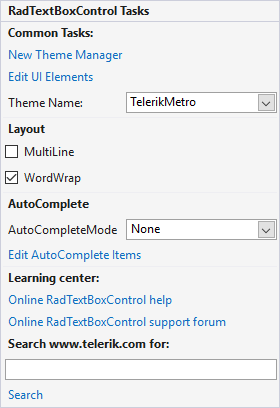

# Smart Tag

The __Smart Tag__ of __RadTextBoxControl__ lets you quickly access common tasks involved with and customizing the layout or setting the theme.

>caption Figure 1: The Smart Tag of RadTextBoxControl

        

* __Common Tasks__
    - __New Theme Manager:__ Adds a new __RadThemeManager__ component to the form.
    - __Edit UI elements:__ Opens a dialog that displays the __Element Hierarchy Editor.__ This editor lets you browse all the elements in the control.
    - __Theme Name:__ Select a theme name from the drop down list of themes available for that control. Selecting a theme allows you to change all aspects of the controls visual style at one time.
* __Layout__
    - Enable The MultiLine.
    - Enable the WordWrap
* __AutoComplete:__ Set the auto-complete mode. 
* __Learning Center:__ Navigate to the Telerik help, code library projects or support forum.
* __Search:__ Search the Telerik site for a given string.

# See Also

* [Add Themes]()
* [Caret positioning and selection]()
* [Creating custom blocks]()
* [Structure]()
* [Properties and Events]()
* [Text editing]()
