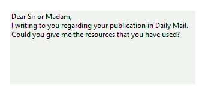
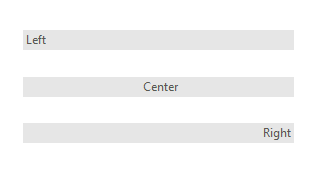

# Getting Started with WinForms TextBoxControl

The __RadTextBoxControl__ is used to get input from the user or to display text. The control can display multiple lines, wrap text to the size of the control, add basic formatting, use themes, and the main differences with RadTextBox - can be transparent and use gradients. The text box control provides a single format style for the text displayed or entered.
         
The text displayed by the control resides in the __Text__ property. It can be set at design time via the `Properties` window in Visual Studio, at run time in code, or by user input at run time. The current contents of a text box can be retrieved at run time by via the __Text__ property.
        

The code below sets text in the control at run time: 

{{source=..\SamplesCS\Editors\TextBoxControl.cs region=SetText}} 
{{source=..\SamplesVB\Editors\TextBoxControl.vb region=SetText}} 

````C#
        
private void SetDefaultText()
{
    this.radTextBoxControl1.Text = "Type your name here.";
}

````
````VB.NET
Private Sub SetDefaultText()
    Me.RadTextBoxControl1.Text = "Type your name here."
End Sub

````

{{endregion}} 

>caption Figure 1: Set the text at runtime.


You can also define the lines in the text box at run time: 

{{source=..\SamplesCS\Editors\TextBoxControl.cs region=Lines}} 
{{source=..\SamplesVB\Editors\TextBoxControl.vb region=Lines}} 

````C#
        
private void SetLines()
{
    string[] lines = new string[]
    {
        "Dear Sir or Madam,",
        "I writing to you regarding your publication in Daily Mail.",
        "Could you give me the resources that you have used?"
    };
    this.radTextBoxControl1.Lines = lines;
}

````
````VB.NET
Private Sub SetLines()
    Dim lines As String() = New String() {"Dear Sir or Madam,", "I writing to you regarding your publication in Daily Mail.", "Could you give me the resources that you have used?"}
    Me.RadTextBoxControl1.Lines = lines
End Sub

````

{{endregion}} 

>caption Figure 2: Set the lines of a multiline text box.


By setting the __NullText__ property, the control will display a custom string when the __Text__ property is empty or null: 

{{source=..\SamplesCS\Editors\TextBoxControl.cs region=SetNullText}} 
{{source=..\SamplesVB\Editors\TextBoxControl.vb region=SetNullText}} 

````C#
    
private void SetNullText()
{
    this.radTextBoxControl1.NullText = "Type your name...";
}

````
````VB.NET
Private Sub SetNullText()
    Me.RadTextBoxControl1.NullText = "Type your name..."
End Sub

````

{{endregion}} 

>caption Figure 3: Setting the null text.


Based on the value set to the __TextAlign__ property, the control will display its content aligned to the left, center or right: 

{{source=..\SamplesCS\Editors\TextBoxControl.cs region=SetTextAlign}} 
{{source=..\SamplesVB\Editors\TextBoxControl.vb region=SetTextAlign}} 

````C#
        
public void SetTextAlign()
{
    this.radTextBoxControl1.TextAlign = HorizontalAlignment.Left;
}

````
````VB.NET
Private Sub SetTextAlign()
    Me.RadTextBoxControl1.TextAlign = HorizontalAlignment.Left
End Sub

````

{{endregion}} 

>caption Figure 4: Aligning the text to different positions.


# See Also

* [AutoComplete]()
* [Caret positioning and selection]()
* [Creating custom blocks]()
* [Structure]()
* [Properties and Events]()
* [Text editing]()

## Telerik UI for WinForms Learning Resources
* [Getting Started with Telerik UI for WinForms Components](https://docs.telerik.com/devtools/winforms/getting-started/first-steps)
* [Telerik UI for WinForms Setup](https://docs.telerik.com/devtools/winforms/installation-and-upgrades/installing-on-your-computer)
* [Telerik UI for WinForms Application Modernization](https://docs.telerik.com/devtools/winforms/winforms-converter/overview)
* [Telerik UI for WinForms Visual Studio Templates](https://docs.telerik.com/devtools/winforms/visual-studio-integration/visual-studio-templates)
* [Deploy Telerik UI for WinForms Applications](https://docs.telerik.com/devtools/winforms/deployment-and-distribution/application-deployment)
* [Telerik UI for WinForms Virtual Classroom(Training Courses for Registered Users)](https://learn.telerik.com/learn/course/external/view/elearning/17/telerik-ui-for-winforms)
* [Telerik UI for WinForms License Agreement)](https://www.telerik.com/purchase/license-agreement/winforms-dlw-s)

