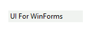

# RadTextBoxControl

__RadTextBoxControl__ provides similar to the standard .NET Framework text box features. In addition it allows easy customizations and enhancements. It is generally used for editing text, although it can be used to display text, when in read-only mode. The control can display multiple lines, wrap text to the size of the control and perform text block formatting and replacement.





>caption Figure 1: RadTextBoxControl
        

Key Features:

* Auto-complete in bound and unbound mode

* Customizable appearance and theming mechanism

* Selection and navigation

* Localizable context menu  

* Flexible and intuitive API

* [IME](https://msdn.microsoft.com/en-us/library/cc194855.aspx) support.

# See Also

* [AutoComplete]()
* [Caret positioning and selection]()
* [Creating custom blocks]()
* [Structure]()
* [Properties and Events]()
* [Text editing]()