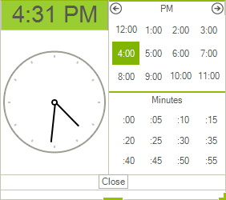
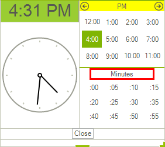
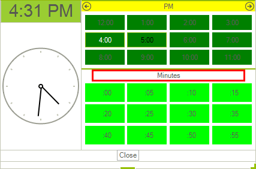
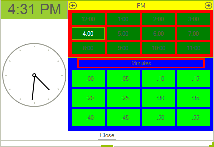
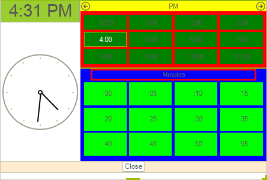

# Customizing Programmatically

Each of the control's elements can be accessed and customized. At the [Structure](), you can find what is the control's structure. Once you access the desired elements, you can tweak its properties in order to modify it. In this article, we will take a look at code snippets, demonstrating how to access and modify different parts of the control.
      

## Customize text box

For example the editable area of the control consist of __RadTextBoxItem__ hosted in __RadMaskedEditBoxElement__. So in order to customize the text box __BackColor__ you need to set both the __BackColor__ of the __RadTextBoxItem__ and of the __RadMaskedEditBoxElement__ `FillPrimitive`:  

````C#
radTimePicker1.TimePickerElement.MaskedEditBox.Fill.BackColor = Color.Red;
radTimePicker1.TimePickerElement.MaskedEditBox.TextBoxItem.BackColor = Color.Red;

````
````VB.NET
RadTimePicker1.TimePickerElement.MaskedEditBox.Fill.BackColor = Color.Red
RadTimePicker1.TimePickerElement.MaskedEditBox.TextBoxItem.BackColor = Color.Red

````


## Customize Dropdown Button

Here is how you can set some left and right padding of the drop down button: 

````C#
radTimePicker1.TimePickerElement.DropDownButton.Padding = new Padding(10,0,10,0);

````
````VB.NET
RadTimePicker1.TimePickerElement.DropDownButton.Padding = New Windows.Forms.Padding(10, 0, 10, 0)

````


## Customize up/down buttons

Here is how to access and set the border color of the arrow buttons: 


````C#
this.radTimeOnlyPicker1.TimeOnlyPickerElement.UpButton.Border.GradientStyle = Telerik.WinControls.GradientStyles.Solid;
this.radTimeOnlyPicker1.TimeOnlyPickerElement.UpButton.Border.ForeColor = Color.Blue;
this.radTimeOnlyPicker1.TimeOnlyPickerElement.UpButton.Border.Visibility = ElementVisibility.Visible;
this.radTimeOnlyPicker1.TimeOnlyPickerElement.DownButton.Border.GradientStyle = Telerik.WinControls.GradientStyles.Solid;
this.radTimeOnlyPicker1.TimeOnlyPickerElement.DownButton.Border.ForeColor = Color.Blue;
this.radTimeOnlyPicker1.TimeOnlyPickerElement.DownButton.Border.Visibility = ElementVisibility.Visible;

````
````VB.NET
Me.RadTimeOnlyPicker1.TimeOnlyPickerElement.UpButton.Border.GradientStyle = Telerik.WinControls.GradientStyles.Solid
Me.RadTimeOnlyPicker1.TimeOnlyPickerElement.UpButton.Border.ForeColor = Color.Blue
Me.RadTimeOnlyPicker1.TimeOnlyPickerElement.UpButton.Border.Visibility = ElementVisibility.Visible;
Me.RadTimeOnlyPicker1.TimeOnlyPickerElement.DownButton.Border.GradientStyle = Telerik.WinControls.GradientStyles.Solid
Me.RadTimeOnlyPicker1.TimeOnlyPickerElement.DownButton.Border.ForeColor = Color.Blue
Me.RadTimeOnlyPicker1.TimeOnlyPickerElement.DownButton.Border.Visibility = ElementVisibility.Visible;

````


## Customize clock element appearance

Here is how to change the clock header background and font and also how to hide the seconds arrow from the clock:

````C#
//customize header
this.radTimeOnlyPicker1.TimeOnlyPickerElement.PopupContentElement.ClockHeaderElement.Font = new System.Drawing.Font("Arial", 22);
this.radTimeOnlyPicker1.TimeOnlyPickerElement.PopupContentElement.ClockHeaderElement.GradientStyle = Telerik.WinControls.GradientStyles.Solid;
this.radTimeOnlyPicker1.TimeOnlyPickerElement.PopupContentElement.ClockHeaderElement.BackColor = Color.YellowGreen;
this.radTimeOnlyPicker1.TimeOnlyPickerElement.PopupContentElement.ClockHeaderElement.DrawFill = true;
//hide seconds arrow
this.radTimeOnlyPicker1.TimeOnlyPickerElement.PopupContentElement.ClockElement.SecondsArrow.Visibility = Telerik.WinControls.ElementVisibility.Collapsed;

````
````VB.NET
      
Me.RadTimeOnlyPicker1.TimeOnlyPickerElement.PopupContentElement.ClockHeaderElement.Font = New System.Drawing.Font("Arial", 22)
Me.RadTimeOnlyPicker1.TimeOnlyPickerElement.PopupContentElement.ClockHeaderElement.GradientStyle = Telerik.WinControls.GradientStyles.Solid
Me.RadTimeOnlyPicker1.TimeOnlyPickerElement.PopupContentElement.ClockHeaderElement.BackColor = Color.YellowGreen
Me.RadTimeOnlyPicker1.TimeOnlyPickerElement.PopupContentElement.ClockHeaderElement.DrawFill = true;
        
Me.RadTimeOnlyPicker1.TimeOnlyPickerElement.PopupContentElement.ClockElement.SecondsArrow.Visibility = Telerik.WinControls.ElementVisibility.Collapsed

````

{{endregion}} 



## Customize hours and minutes headers

This code snippet demonstrates how to change the hours header back color and the minutes header border appearance:

````C#
//hours header
this.radTimeOnlyPicker1.TimeOnlyPickerElement.PopupContentElement.HoursTable.TableHeader.GradientStyle = Telerik.WinControls.GradientStyles.Solid;
this.radTimeOnlyPicker1.TimeOnlyPickerElement.PopupContentElement.HoursTable.TableHeader.BackColor = Color.Yellow;
this.radTimeOnlyPicker1.TimeOnlyPickerElement.PopupContentElement.HoursTable.TableHeader.DrawFill = true;
//minutes header
this.radTimeOnlyPicker1.TimeOnlyPickerElement.PopupContentElement.MinutesTable.TableHeader.HeaderElement.DrawBorder = true;
this.radTimeOnlyPicker1.TimeOnlyPickerElement.PopupContentElement.MinutesTable.TableHeader.HeaderElement.BorderWidth = 3;
this.radTimeOnlyPicker1.TimeOnlyPickerElement.PopupContentElement.MinutesTable.TableHeader.HeaderElement.BorderColor = Color.Red;
this.radTimeOnlyPicker1.TimeOnlyPickerElement.PopupContentElement.MinutesTable.TableHeader.HeaderElement.BorderGradientStyle = Telerik.WinControls.GradientStyles.Solid;

````
````VB.NET
      
Me.RadTimeOnlyPicker1.TimeOnlyPickerElement.PopupContentElement.HoursTable.TableHeader.GradientStyle = Telerik.WinControls.GradientStyles.Solid
Me.RadTimeOnlyPicker1.TimeOnlyPickerElement.PopupContentElement.HoursTable.TableHeader.BackColor = Color.Yellow
Me.RadTimeOnlyPicker1.TimeOnlyPickerElement.PopupContentElement.HoursTable.TableHeader.DrawFill = true;
Me.RadTimeOnlyPicker1.TimeOnlyPickerElement.PopupContentElement.MinutesTable.TableHeader.HeaderElement.DrawBorder = True
Me.RadTimeOnlyPicker1.TimeOnlyPickerElement.PopupContentElement.MinutesTable.TableHeader.HeaderElement.BorderWidth = 3
Me.RadTimeOnlyPicker1.TimeOnlyPickerElement.PopupContentElement.MinutesTable.TableHeader.HeaderElement.BorderColor = Color.Red
Me.RadTimeOnlyPicker1.TimeOnlyPickerElement.PopupContentElement.MinutesTable.TableHeader.HeaderElement.BorderGradientStyle = Telerik.WinControls.GradientStyles.Solid

````



## Customize hours and minutes cells appearance

The cells in both minutes and hours tables are placed in a GridLayout. To customize the cells, you can use the TimeCellFormatting event of the control:
        
````C#
void RadTimeOnlyPicker1_TimeCellFormatting(object sender, Telerik.WinControls.UI.TimeCellFormattingEventArgs e)
{
    e.Element.GradientStyle = Telerik.WinControls.GradientStyles.Solid;
    e.Element.Margin = new Padding(2);
    if (e.IsMinute)
    {
        //set minute cells specific properties
        e.Element.BackColor = Color.Lime;
    }
    else
    {
        //set hours cells specific properties
        e.Element.BackColor = Color.Green;
    }
}

````
````VB.NET
Private Sub RadTimeOnlyPicker1_TimeCellFormatting(sender As Object, e As Telerik.WinControls.UI.TimeCellFormattingEventArgs)
    e.Element.GradientStyle = Telerik.WinControls.GradientStyles.Solid
    e.Element.Margin = New Windows.Forms.Padding(2)
    If e.IsMinute Then
     
        e.Element.BackColor = Color.Lime
    Else
    
        e.Element.BackColor = Color.Green
    End If
End Sub

````



## Customize hours and minutes tables 

This is how you can set the hours and minutes tables background color:

````C#
/hours table
this.radTimeOnlyPicker1.TimeOnlyPickerElement.PopupContentElement.HoursTable.DrawFill = true;
this.radTimeOnlyPicker1.TimeOnlyPickerElement.PopupContentElement.HoursTable.GradientStyle = Telerik.WinControls.GradientStyles.Solid;
this.radTimeOnlyPicker1.TimeOnlyPickerElement.PopupContentElement.HoursTable.BackColor = Color.Red;
//minutes table
this.radTimeOnlyPicker1.TimeOnlyPickerElement.PopupContentElement.MinutesTable.DrawFill = true;
this.radTimeOnlyPicker1.TimeOnlyPickerElement.PopupContentElement.MinutesTable.GradientStyle = Telerik.WinControls.GradientStyles.Solid;
this.radTimeOnlyPicker1.TimeOnlyPickerElement.PopupContentElement.MinutesTable.BackColor = Color.Blue;

````
````VB.NET
    
Me.RadTimeOnlyPicker1.TimeOnlyPickerElement.PopupContentElement.HoursTable.DrawFill = True
Me.RadTimeOnlyPicker1.TimeOnlyPickerElement.PopupContentElement.HoursTable.GradientStyle = Telerik.WinControls.GradientStyles.Solid
Me.RadTimeOnlyPicker1.TimeOnlyPickerElement.PopupContentElement.HoursTable.BackColor = Color.Red
    
Me.RadTimeOnlyPicker1.TimeOnlyPickerElement.PopupContentElement.MinutesTable.DrawFill = True
Me.RadTimeOnlyPicker1.TimeOnlyPickerElement.PopupContentElement.MinutesTable.GradientStyle = Telerik.WinControls.GradientStyles.Solid
Me.RadTimeOnlyPicker1.TimeOnlyPickerElement.PopupContentElement.MinutesTable.BackColor = Color.Blue

````

{{endregion}} 



## Customize Button Panel

Here is how to change the BackColor of the FooterPanel:

{{source=..\SamplesCS\Editors\TimePicker1.cs region=CustomizeFooterPanel}} 
{{source=..\SamplesVB\Editors\TimePicker1.vb region=CustomizeFooterPanel}} 

````C#
radTimePicker1.TimePickerElement.PopupContentElement.FooterPanel.BackColor = Color.BlanchedAlmond;

````
````VB.NET
RadTimePicker1.TimePickerElement.PopupContentElement.FooterPanel.BackColor = Color.BlanchedAlmond

````

{{endregion}} 



## See Also

[Themes]()
