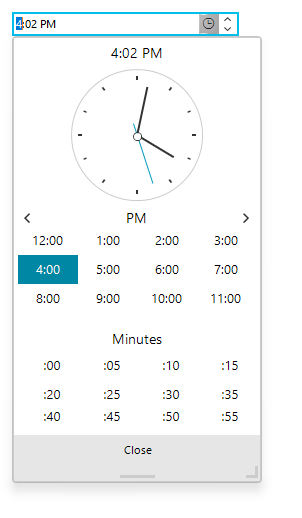

# Getting Started with WinForms TimeOnlyPicker

This tutorial will demonstrate how to get started with __RadTimeOnlyPicker__ control, its functionalities and customization abilities:     

* Drag __RadTimeOnlyPicker__ from the toolbox to the form.

* Modify the desired minute’s interval by setting the __Step__ property.

* Set hour format by modifying the __Culture__ property. For example "en-US" uses 12 hour format while “en-GB” uses 24 hour format.

* Set the __ClockPosition__ property to *ClockAboveTables* to display the clock on the top of the popup.

* Set the __CloseButtonText__ to some string – *“Close window”*

* If needed you can set the __NullText__ property  this is the text which will be displayed in the control value is *null*

Here is how the control will look like, after the modifications:

## See Also

* [Structure]()
* [Properties and Events]()
* [Localization]()

## Telerik UI for WinForms Learning Resources
* [Getting Started with Telerik UI for WinForms Components](https://docs.telerik.com/devtools/winforms/getting-started/first-steps)
* [Telerik UI for WinForms Setup](https://docs.telerik.com/devtools/winforms/installation-and-upgrades/installing-on-your-computer)
* [Telerik UI for WinForms Application Modernization](https://docs.telerik.com/devtools/winforms/winforms-converter/overview)
* [Telerik UI for WinForms Visual Studio Templates](https://docs.telerik.com/devtools/winforms/visual-studio-integration/visual-studio-templates)
* [Deploy Telerik UI for WinForms Applications](https://docs.telerik.com/devtools/winforms/deployment-and-distribution/application-deployment)
* [Telerik UI for WinForms Virtual Classroom(Training Courses for Registered Users)](https://learn.telerik.com/learn/course/external/view/elearning/17/telerik-ui-for-winforms)
* [Telerik UI for WinForms License Agreement)](https://www.telerik.com/purchase/license-agreement/winforms-dlw-s)

