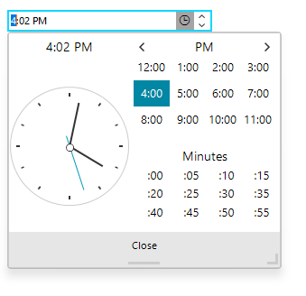

# WinForms TimeOnlyPicker Overview

The __RadTimeOnlyPicker__ control, designed specifically for handling __TimeOnly__ values in .NET Core, enables users to enter or select time values easily. It features an editable area for direct time entry and a dropdown with a __RadClock__ for hour and minute selection, supporting null values, 12- and 24-hour formats based on culture settings, and customizable formatting. This makes it ideal for applications that require precise time management without date components.





>caption Figure 1: Collapsed:

>caption Figure 2: Expanded:

## Telerik UI for WinForms Learning Resources
* [Telerik UI for WinForms API Reference](https://docs.telerik.com/devtools/winforms/api/)
* [Getting Started with Telerik UI for WinForms Components]()
* [Telerik UI for WinForms Virtual Classroom (Training Courses for Registered Users)](https://learn.telerik.com/learn/course/external/view/elearning/17/TelerikUIforWinForms) 
* [Telerik UI for WinForms Forum](https://www.telerik.com/forums/winforms)
* [Telerik UI for WinForms Knowledge Base](https://docs.telerik.com/devtools/winforms/knowledge-base)

## Telerik UI for WinForms Additional Resources
* [Telerik UI for WinForms Product Overview](https://www.telerik.com/products/winforms.aspx)
* [Telerik UI for WinForms Blog](https://www.telerik.com/blogs/desktop-winforms)
* [Telerik UI for WinForms Videos](https://www.telerik.com/videos/product/winforms)
* [Telerik UI for WinForms Roadmap](https://www.telerik.com/support/whats-new/winforms/roadmap)
* [Telerik UI for WinForms Pricing](https://www.telerik.com/purchase/individual/winforms.aspx)
* [Telerik UI for WinForms Code Library](https://www.telerik.com/support/code-library/winforms)
* [Telerik UI for WinForms Support](https://www.telerik.com/support/winforms)
* [What’s New in Telerik UI for WinForms](https://www.telerik.com/support/whats-new/winforms)

## See Also

* [Structure]()
* [Properties and Events]()
* [Localization]()
