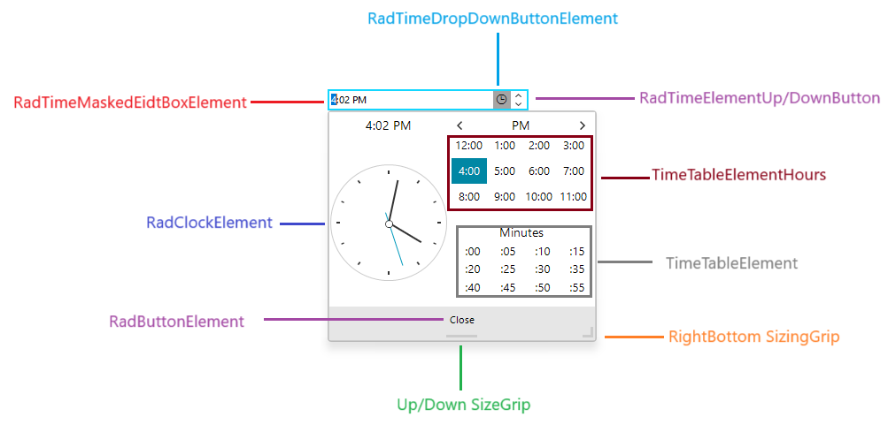

# Structure

The following image demonstrates the structure of __RadTimeOnlyPicker__ control, which might come in handy when you need to access different control elements:

>caption Figure 1: RadTimeOnlyPicker elements structure. 

# Elements Hierarchy

>caption Figure 2: The Elements hierarchy of RadTimeOnlyPicker.
![WinForms RadTimeOnlyPicker Elements Hierarchy]images/editors-timeonlypicker-structure002.png)

# PopupContentElement Hierarchy 

>caption Figure 3: The hierarchy of the popup element.

## See Also

* [Properties and Events]()
* [Localization]()
