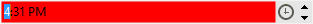
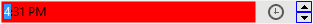
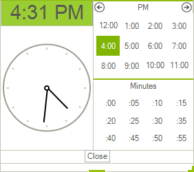
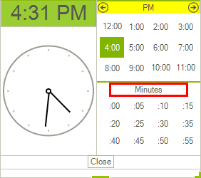
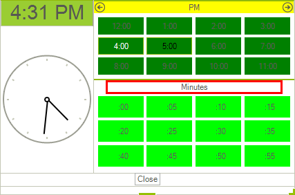
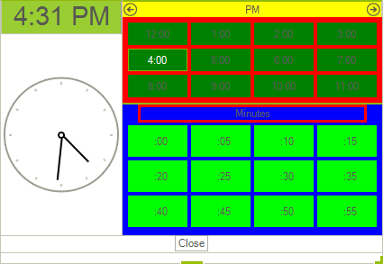
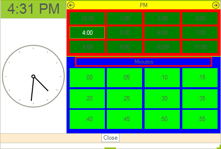

# Customizing Programmatically

Each of the control's elements can be accessed and customized. At the [Structure](), you can find what is the control's structure. Once you access the desired elements, you can tweak its properties in order to modify it. In this article, we will take a look at code snippets, demonstrating how to access and modify different parts of the control.
      

## Customize text box

For example the editable area of the control consist of __RadTextBoxItem__ hosted in __RadMaskedEditBoxElement__. So in order to customize the text box __BackColor__ you need to set both the __BackColor__ of the __RadTextBoxItem__ and of the __RadMaskedEditBoxElement__ `FillPrimitive`: 

<snippet id='editors-timepicker1-customizetextbox-cs' />
<snippet id='editors-timepicker1-customizetextbox-vb' />

## Customize Dropdown Button

Here is how you can set some left and right padding of the drop down button: 

<snippet id='editors-timepicker1-customizedropdownbutton-cs' />
<snippet id='editors-timepicker1-customizedropdownbutton-vb' />

## Customize up/down buttons

Here is how to access and set the border color of the arrow buttons: 

<snippet id='editors-timepicker1-customizearrowbuttons-cs' />
<snippet id='editors-timepicker1-customizearrowbuttons-vb' />

## Customize clock element appearance

Here is how to change the clock header background and font and also how to hide the seconds arrow from the clock:

<snippet id='editors-timepicker1-customizeclock-cs' />
<snippet id='editors-timepicker1-customizeclock-vb' />

## Customize hours and minutes headers

This code snippet demonstrates how to change the hours header back color and the minutes header border appearance:
        
<snippet id='editors-timepicker1-customizehoursandminutesheaders-cs' />
<snippet id='editors-timepicker1-customizehoursandminutesheaders-vb' />

## Customize hours and minutes cells appearance

The cells in both minutes and hours tables are placed in a GridLayout. To customize the cells, you can use the TimeCellFormatting event of the control:
        
<snippet id='editors-timepicker1-cellformatting-cs' />
<snippet id='editors-timepicker1-cellformatting-vb' />

## Customize hours and minutes tables 

This is how you can set the hours and minutes tables background color:

<snippet id='editors-timepicker1-customizehoursandminutestables-cs' />
<snippet id='editors-timepicker1-customizehoursandminutestables-vb' />

## Customize Button Panel

Here is how to change the BackColor of the FooterPanel:

<snippet id='editors-timepicker1-customizefooterpanel-cs' />
<snippet id='editors-timepicker1-customizefooterpanel-vb' />

# See Also

[Themes]()
