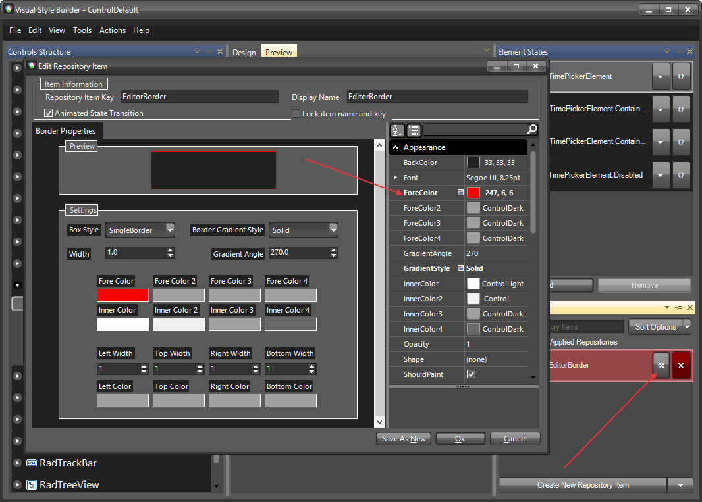

# Themes

This help article will demonstrate a step by step tutorial how to customize the `ControlDefault` theme for __RadTimePicker__

1. Open [Visual Style Builder] ()
2. Export the built-in themes in a specific folder by selecting `File` >> `Export Built-in Themes`.
3. Load a desired theme from the just exported files by selecting `File` >> `Open Package`.
4. Expand __RadTimePicker__ and select the `TimePickerBorder`. 
   

5. Open the `Edit Repository Item` dialog and change the `ForeColor`:
   

6. The bellow image shows the result.
   

>note The following article shows how you can use the new theme: [Using Custom Themes]().

# See Also 

[Customizing Programmatically]()
