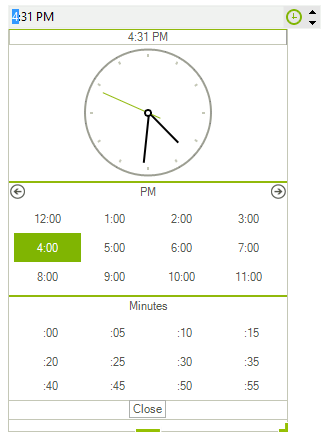

# Getting Started

| RELATED VIDEOS |  |
| ------ | ------ |
|[Getting Started with RadTimePicker for WinForms](http://tv.telerik.com/watch/winforms/getting-started-with-radtimepicker-for-winforms) This video demonstrates the new RadTimePicker control as well as several properties you should be aware of.||

This tutorial will demonstrate how to get started with __RadTimePicker__ control, its functionalities and customization abilities:
        

* Drag __RadTimePicker__ from the toolbox to the form.

* Modify the desired minute’s interval by setting the __Step__ property.

* Set hour format by modifying the __Culture__ property. For example "en-US" uses 12 hour format while “en-GB” uses 24 hour format.

* Set the __ClockPosition__ property to *ClockAboveTables* to display the clock on the top of the popup.

* Set the __CloseButtonText__ to some string – *“Close window”*

* If needed you can set the __NullText__ property  this is the text which will be displayed in the control value is *null*

Here is how the control will look like, after the modifications:

# See Also

* [Structure]()
* [Properties and Events]()
* [Localization]()
* [Free Form Date Time Parsing]()
