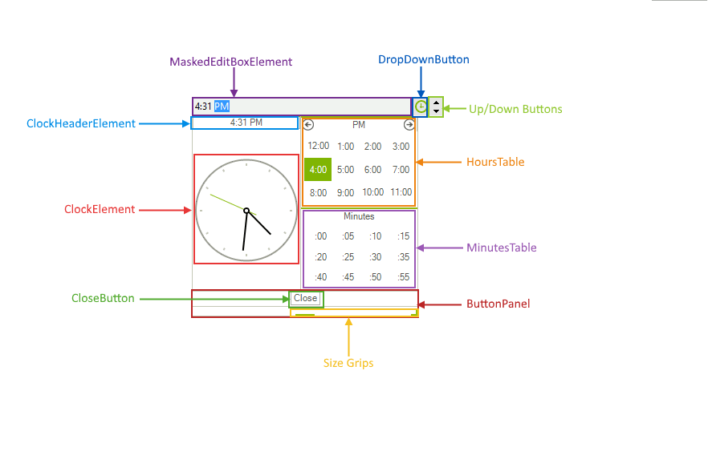
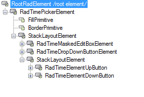
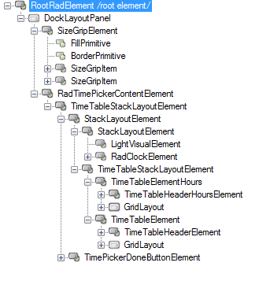

# Structure

The following image demonstrates the structure of __RadTimePicker__ control, which might come in handy when you need to access different control elements:

>caption Figure 1: RadTimePicker elements structure. 

# Elements Hierarchy

>caption Figure 2: The Elements hierarchy of RadTimePicker.

# PopupContentElement Hierarchy 

>caption Figure 3: The hierarchy of the popup element.

# See Also

* [Properties and Events]()
* [Localization]()
* [Free Form Date Time Parsing]()
