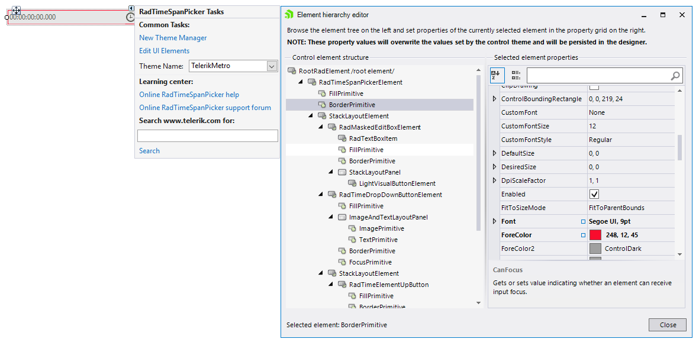
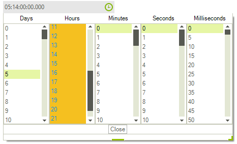

# Customizing Appearance

Accessing and customizing elements can be performed either at design time, or at run time. To format the items in the drop down you will need to handle the VisualItemFormatting event at in the code behind.

## Design Time

You can access and modify the style for the different elements in the editable area of __RadTimeSpanPicker__ by using the Element hierarchy editor.

>tip In order to access the Element hierarchy editor select RadFontDropDownList and click the small arrow on the top right position in order to open the Smart Tag. Then, click the Edit UI Elements.




## Formating Items

The drop down consist of several ListControlElements which represent the time span components. To change their styles you need to handle the __VisualItemFormatting__ event. 

#### Formating Items in the Popup

{{source=..\SamplesCS\Editors\TimeSpanCode.cs region=Formatting}} 
{{source=..\SamplesVB\Editors\TimeSpanCode.vb region=Formatting}}
````C#
protected override void OnLoad(EventArgs e)
{
    base.OnLoad(e);
    radTimeSpanPicker1.PopupContentElement.ComponentsCreated += PopupContentElement_ComponentsCreated;
}
private void PopupContentElement_ComponentsCreated(object sender, EventArgs e)
{
    foreach (ITimeSpanPickerComponent component in radTimeSpanPicker1.PopupContentElement.Components)
    {
        ListTimeSpanPickerUIComponent listUiCompoinent = component.TimeSpanPickerUIComponent as ListTimeSpanPickerUIComponent;
        listUiCompoinent.ListElement.Tag = this.radTimeSpanPicker1.PopupContentElement.Components.IndexOf(component as RadItem);
        listUiCompoinent.ListElement.VisualItemFormatting += ListElement_VisualItemFormatting;
    }
}
private void ListElement_VisualItemFormatting(object sender, VisualItemFormattingEventArgs args)
{
    int componentIndex = (int)args.VisualItem.Data.Owner.Tag;
    if (componentIndex == 1)
    {
        args.VisualItem.BackColor = ColorTranslator.FromHtml("#f5c020");
        args.VisualItem.ForeColor = ColorTranslator.FromHtml("#008de7");
        args.VisualItem.GradientStyle = GradientStyles.Solid;
    }
    else
    {
        args.VisualItem.ResetValue(RadListVisualItem.BackColorProperty, ValueResetFlags.Local);
        args.VisualItem.ResetValue(RadListVisualItem.GradientStyleProperty, ValueResetFlags.Local);
        args.VisualItem.ResetValue(RadListVisualItem.ForeColorProperty, ValueResetFlags.Local);
    }
}

````
````VB.NET
Protected Overrides Sub OnLoad(ByVal e As EventArgs)
    MyBase.OnLoad(e)
    AddHandler radTimeSpanPicker1.PopupContentElement.ComponentsCreated, AddressOf PopupContentElement_ComponentsCreated
End Sub
Private Sub PopupContentElement_ComponentsCreated(ByVal sender As Object, ByVal e As EventArgs)
    For Each component As ITimeSpanPickerComponent In radTimeSpanPicker1.PopupContentElement.Components
        Dim listUiCompoinent As ListTimeSpanPickerUIComponent = TryCast(component.TimeSpanPickerUIComponent, ListTimeSpanPickerUIComponent)
        listUiCompoinent.ListElement.Tag = Me.radTimeSpanPicker1.PopupContentElement.Components.IndexOf(TryCast(component, RadItem))
        AddHandler listUiCompoinent.ListElement.VisualItemFormatting, AddressOf ListElement_VisualItemFormatting
    Next component
End Sub
Private Sub ListElement_VisualItemFormatting(ByVal sender As Object, ByVal args As VisualItemFormattingEventArgs)
    Dim componentIndex As Integer = CInt(Fix(args.VisualItem.Data.Owner.Tag))
    If componentIndex = 1 Then
        args.VisualItem.BackColor = ColorTranslator.FromHtml("#f5c020")
        args.VisualItem.ForeColor = ColorTranslator.FromHtml("#008de7")
        args.VisualItem.GradientStyle = GradientStyles.Solid
    Else
        args.VisualItem.ResetValue(RadListVisualItem.BackColorProperty, ValueResetFlags.Local)
        args.VisualItem.ResetValue(RadListVisualItem.GradientStyleProperty, ValueResetFlags.Local)
        args.VisualItem.ResetValue(RadListVisualItem.ForeColorProperty, ValueResetFlags.Local)
    End If
End Sub

```` 

{{endregion}} 

Here is the result.



# See Also

*[Themes]()