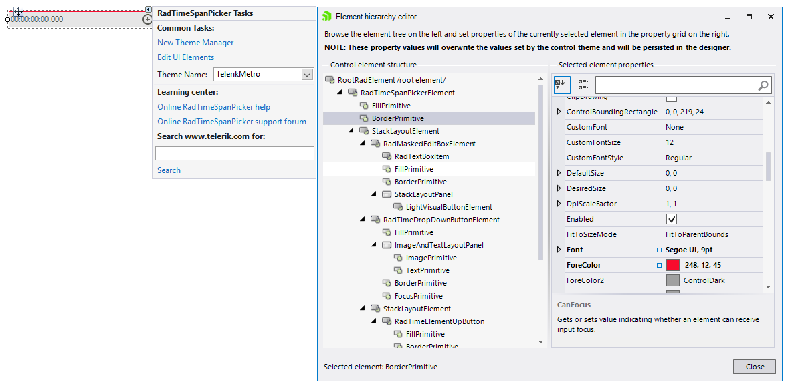
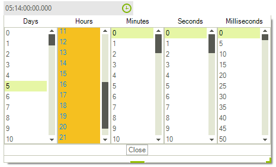

# Customizing Appearance

Accessing and customizing elements can be performed either at design time, or at run time. To format the items in the drop down you will need to handle the **VisualItemFormatting** event at in the code behind.

## Design Time

You can access and modify the style for the different elements in the editable area of __RadTimeSpanPicker__ by using the Element hierarchy editor.

>tip In order to access the Element hierarchy editor select **RadFontDropDownList** and click the small arrow on the top right position in order to open the Smart Tag. Then, click the Edit UI Elements.

## Formating Items

The drop down consist of several **ListControlElements** which represent the time span components. To change their styles you need to handle the __VisualItemFormatting__ event. 

#### Formating Items in the Popup

<snippet id='editors-timespancode-formatting-cs' />
<snippet id='editors-timespancode-formatting-vb' />

Here is the result.

# See Also

*[Themes]()
