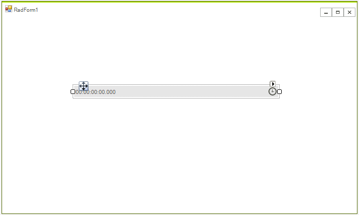
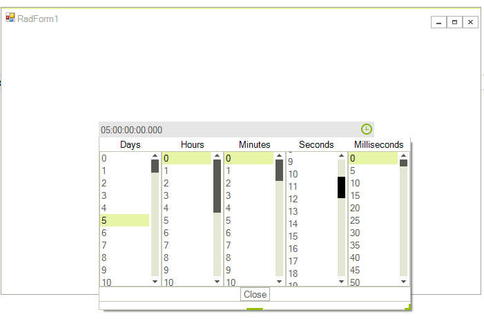

# Getting Started with WinForms TimeSpanPicker

This topic will walk you through the process of creating of __RadTimeSpanPicker__.


1\. Create a blank new application and drop __RadTimeSpanPicker__ on the form. The layout should look like this.



2\. In the code behind set the value of the control. 

{{source=..\SamplesCS\Editors\TimeSpanCode.cs region=getting-started}} 
{{source=..\SamplesVB\Editors\TimeSpanCode.vb region=getting-started}}
````C#
this.radTimeSpanPicker1.Value = TimeSpan.FromDays(5);

````
````VB.NET
Me.radTimeSpanPicker1.Value = TimeSpan.FromDays(5)

```` 

{{endregion}} 

3\. You can start the application and enter a new value.



# See Also

* [Structure]()
* [Properties Methods and Events]()


