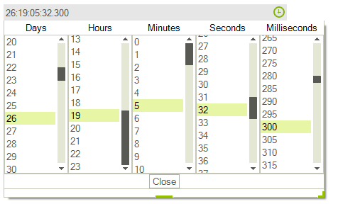

# WinForms TimeSpanPicker Overview

__RadTimeSpanPicker__ is a UI component that provides a full control over picking a specific time span and duration using the built-in components for days, hours, minutes, seconds and milliseconds. You can easily define some minimum/maximum ranges and specific value step for the components. **RadTimeSpanPicker** also provides the ability to create custom components to meet any specific user scenarios.





        
## Key Features

* __TimeSpanComponents__ - __RadTimeSpanPicker__ supports built-in components for picking days, hours, minutes, seconds and milliseconds. A specific minimum/maximum ranges and value step could be set for each component separately. The user can directly enter the value in the editor as well.

*  __Negative Values Support__

*  __Data Binding__

*  __Localization__

*  __Right To Left Support__

## Telerik UI for WinForms Learning Resources
* [Telerik UI for WinForms TimeSpanPicker Homepage](https://www.telerik.com/products/winforms/timespanpicker.aspx)
* [Get Started with the Telerik UI for WinForms TimeSpanPicker]()
* [Telerik UI for WinForms API Reference](https://docs.telerik.com/devtools/winforms/api/)
* [Getting Started with Telerik UI for WinForms Components]()
* [Telerik UI for WinForms Virtual Classroom (Training Courses for Registered Users)](https://learn.telerik.com/learn/course/external/view/elearning/17/TelerikUIforWinForms) 
* [Telerik UI for WinForms Forum](https://www.telerik.com/forums/winforms)
* [Telerik UI for WinForms Knowledge Base](https://docs.telerik.com/devtools/winforms/knowledge-base)

## Telerik UI for WinForms Additional Resources
* [Telerik UI for WinForms Product Overview](https://www.telerik.com/products/winforms.aspx)
* [Telerik UI for WinForms Blog](https://www.telerik.com/blogs/desktop-winforms)
* [Telerik UI for WinForms Videos](https://www.telerik.com/videos/product/winforms)
* [Telerik UI for WinForms Roadmap](https://www.telerik.com/support/whats-new/winforms/roadmap)
* [Telerik UI for WinForms Pricing](https://www.telerik.com/purchase/individual/winforms.aspx)
* [Telerik UI for WinForms Code Library](https://www.telerik.com/support/code-library/winforms)
* [Telerik UI for WinForms Support](https://www.telerik.com/support/winforms)
* [What’s New in Telerik UI for WinForms](https://www.telerik.com/support/whats-new/winforms)

## See Also

* [Getting Started]()
* [Structure]()
