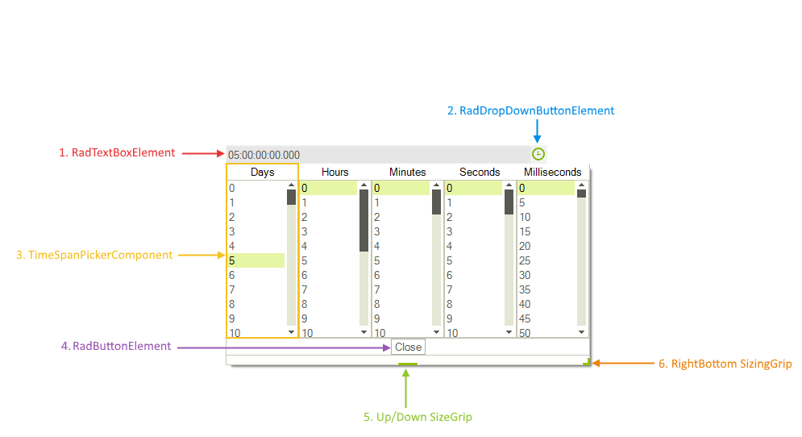
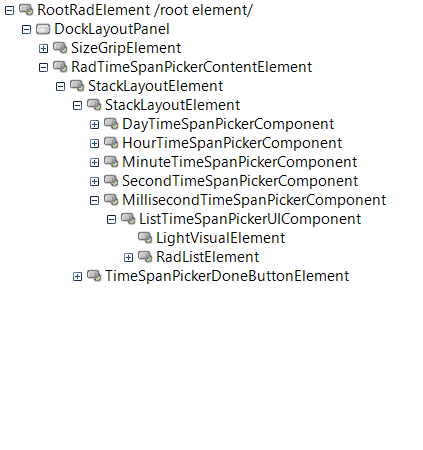

# Structure

This article describes all the visual elements and terms used in __RadTimeSpanPicker__ control.

## Elements Hierarchy

# See Also

 * [Getting Started]()

 * [Properties Methods and Events]()