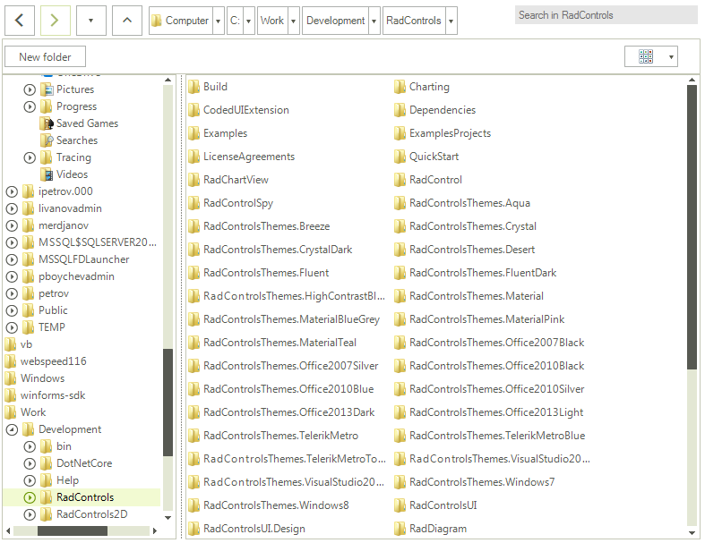
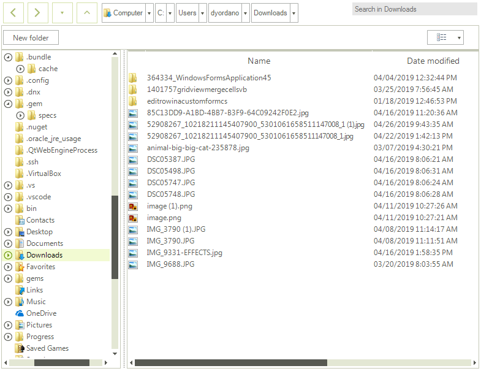

#  Explorer Control

The **ExplorerControl** is the view that presents the UI of the dialogs. When a dialog is opened its content is shown via this control.

The **ExplorerControl** element can be used as a stand-alone control, thus allowing you to set it as the content of a **UserControl**, a Window, etc.

>caption Figure 1. ExplorerControl

 

####  Example 1: Define explorer control

````C#

ExplorerControl explorerControl = new ExplorerControl();
explorerControl.CurrentDirectoryPath = @"C:\Work\Development\RadControls";
this.Controls.Add(explorerControl);


````
````VB.NET

Dim explorerControl As ExplorerControl = New ExplorerControl()
explorerControl.CurrentDirectoryPath = "C:\Work\Development\RadControls"
Me.Controls.Add(explorerControl)


````

## Common Features

The **ExplorerControl** supports most of the features described in the *Features* section of the documentation.

## Using the ExplorerControl

Here are some of the key properties that the **ExplorerControl** exposes:

* **CurrentDirectoryPath** - Gets or sets a value indicating the path of the current directory in the **ExplorerControl** instance.

* **ExpandToCurrentDirectory** - Gets or sets a value indicating whether the main navigation pane expands and brings into view the current directory.

* **Filter** - Gets or sets the filter string that describes the list of extensions to filter by. It has an effect only when the **IsFolderBrowser** property is *False*.

* **FilterDescriptors** - Gets the list of the Telerik.WinControls.FileDialogs.FileDialogs.**FileFilterDescriptor** specified by the **Filter** property. It has effect only when **IsFolderBrowser** is *False*.

* **FilterIndex** - Gets or sets a value indicating the current filter index from the list of filter strings specified by the **Filter** property. It has an effect only when the **IsFolderBrowser** property is *False*.

* **IsFolderBrowser** - Gets or sets a value indicating whether the **ExplorerControl** instance is used for directories selection or both directories and files.

* **LayoutType** - Gets or sets the current Telerik.WinControls.FileDialogs.**LayoutType** of the Main pane.

* **MultiSelect** - Gets or sets a value indicating whether multiple selection of files or folders is allowed.

* **SelectedFileName** - Gets the full path of the currently selected file or directory.

* **SelectedFileNames** - Gets the list of full paths of the currently selected files and / or folders.

* **SelectedSafeFileNames** - Gets the list of names of the currently selected files and / or folders.

* **ShowHiddenFiles** - Gets or sets a boolean value indicating whether hidden files and folders should be visible in the Explorer.

* **ShowNetworkLocations** - Gets or sets a value indicating whether the dialog shows network computers in the navigation tree.

* **ShowSystemCustomPlaces** - Gets or sets a value indicating whether the QuickAccess/Favorites items from the Windows FileExplorer will be shown as child nodes in the CustomPlacesTreeNode. Only applicable for Windows 10 and .NET 4.0

## Setting the Layout

The **ExplorerControl** exposes a **LayoutType** property that determines the layout of the list with the files. This property is similar to the **InitialSelectedLayout** property of the file dialogs.

## Browser Mode

The control can work in two modes - the first one allows you to select folders and files. The second one allows you to select only folders. You can control this via the **IsFolderBrowser** property. If you set the property to *True* you will be able to see and select only folders.

>important Changing the **IsFolderBrowser** property during runtime is not supported. The property is respected only during initializing of the ExplorerControl.

####  Example 2: Allow selecting folders only 

````C#

explorerControl.IsFolderBrowser = true;

````
````VB.NET

explorerControl.IsFolderBrowser = True

````

## Navigating Through Directories

To navigate the explorer to a specific directory you can set its **CurrentDirectoryPath** property as shown in **Example 1**.

## Selection

To get the selected files or folders you can use the **SelectedFileName**, **SelectedFileNames** and **SelectedSafeFileNames** properties of the control.

>important The difference between **SelectedFileNames** and **SelectedSafeFileNames** is that the first collection contains the full paths of the files/folders. And the second collection contains only the names (safe names) of the files/folders.

####  Example 3: Getting the first item from the selected files/folders

````C#

string selectedFile = explorerControl.SelectedFileNames[0]; 

````
````VB.NET

Dim selectedFile As String = explorerControl.SelectedFileNames(0)

````

By default, the selection mode is single which allows you to select a single file or folder. To change this you can set the **MultiSelect** property to *True*.

####  Example 4: Enable multiple selection

````C#

explorerControl.MultiSelect  = true;

````
````VB.NET

explorerControl.MultiSelect  = True

````

## Filtering 

In order to filter the **ExplorerControl**, you can set its **Filter** and **FilterIndex** properties. **Example 5** demonstrates how you can filter the image files.

####  Example 5: Filtering ExplorerControl

````C#

explorerControl.Filter = "Office Files (.doc, *.xls)|.doc;.xls;.xlsx;.ppt|Image Files (.jpg, .png)|.jpg;.png|" +
                                     "Text Files (.txt)|.txt;|Archives Files (.zip, .rar)|.zip;.rar|All Files (.)|.*";
explorerControl.FilterIndex = 1;

````
````VB.NET

explorerControl.Filter = "Office Files (.doc, *.xls)|.doc;.xls;.xlsx;.ppt|Image Files (.jpg, .png)|.jpg;.png|" & "Text Files (.txt)|.txt;|Archives Files (.zip, .rar)|.zip;.rar|All Files (.)|.*"
explorerControl.FilterIndex = 1

````

>caption Figure 2. Filtered ExplorerControl to display images

 

>important Filtering is available only if the **IsFolderBrowser** property is set to *False*.

## Events

The control exposes the following events: **DirectoryRequesting** and **ExceptionRaised**. The first event can be used to filter the navigation. The second event occurs when an exception is raised. It could be raised in different occasions, for example - if the selected folder cannot be accessed or if the file path is too long, or when there is an error while searching, etc.

# See Also
 
* [Error Handling]()
* [RadOpenFileDialog]()
* [RadOpenFolderDialog]()
* [RadSaveFileDialog]()


