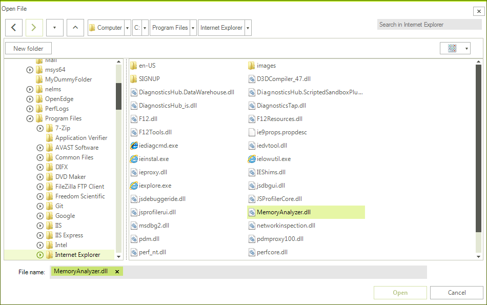
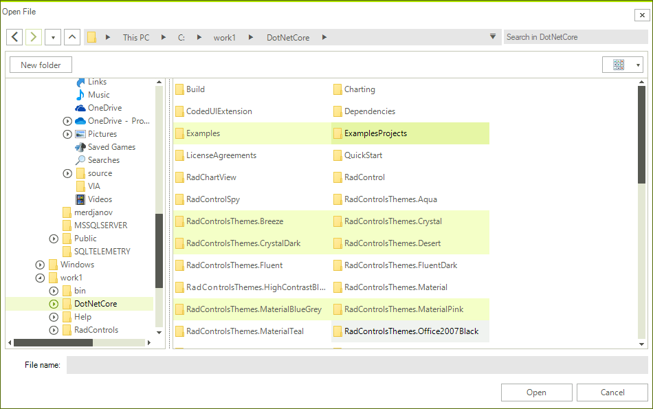
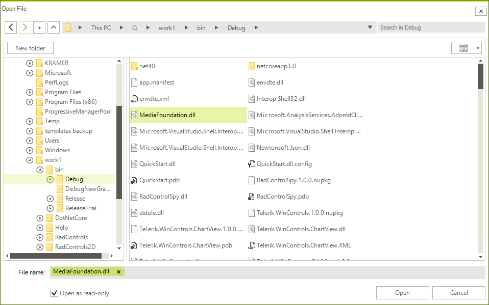

#  RadOpenFileDialog

**RadOpenFileDialog** is a modal dialog box that allows you to specify one or multiple file names to open.

>caption Figure 1: RadOpenFileDialog in single selection mode

 

## Showing the Dialog

To show the dialog call its **ShowDialog** method. If a valid file is opened when you press OK, the **DialogResult** property will return OK and the **FileName**, and **FileNames** properties will be set. You can use **FileName** and **FileNames** to get the names of the selected items.

>important Note that when the **ShowDialog** method is called the UI of the host application will freeze until the dialog closes.

####  Example 1: Show an open file dialog 

<snippet id='file-dialogs-radopenfiledialog-openfiledialogexample-cs' />
<snippet id='file-dialogs-radopenfiledialog-openfiledialogexample-vb' />

## Opening the Selected File

You can open a read-only file stream for the selected file using the OpenFile method. Or alternatively you can use the **FileName** and **FileNames** properties and open the file manually.

####  Example 2: Open a file stream 

<snippet id='file-dialogs-radopenfiledialog-openfilestreamexample-cs' />
<snippet id='file-dialogs-radopenfiledialog-openfilestreamexample-vb' />

## Enabling Multiple Selection

The dialog supports single and multiple selection modes. By default, you can select only one file at a time. To alter this you can set the **Multiselect** property of **RadOpenFileDialog** to *True*.

####  Example 3: Enable multiple selection 

<snippet id='file-dialogs-radopenfiledialog-multipleselectionexample-cs' />
<snippet id='file-dialogs-radopenfiledialog-multipleselectionexample-vb' />

>caption Figure 2: Multiple selection 

 

## Working with the Selected Files

You can get the paths of the selected files via the **FileName** and **FileNames** properties. Note that the properties are empty until the **DialogResult** is valid. When you open file(s) the properties will return the corresponding paths.

You can get only the name of the selected files, without the full path, via the **SafeFileNames** collection property.

####  Example 4: Get the selected file names

<snippet id='file-dialogs-radopenfiledialog-selectedfilenames-cs' />
<snippet id='file-dialogs-radopenfiledialog-selectedfilenames-vb' />

The **FileName** property can be set manually. This will change the value displayed in the selected file auto-complete box area. Note that setting this won't change the selected item in the list with the files.

## Saving the Last Used Directory

You can save the last used directory by setting the **RestoreDirectory** property of the **RadOpenFileDialog**. After setting this property to *True* and opening a file the **InitialDirectory** of this **RadOpenFileDialog** instance will be set to the parent folder of the opened file.

####  Example 5: Set RestoreDirectory property

<snippet id='file-dialogs-radopenfiledialog-restoredirectorypropertyexample-cs' />
<snippet id='file-dialogs-radopenfiledialog-restoredirectorypropertyexample-vb' />

>important Note that the directory restoring feature works per dialog instance and only in memory. This means that the previously selected directory will be stored in a private string field of the RadOpenFolderDialog instance. In other words, to use the feature the following requirements should be met:
* The same dialog instance should be used every time you open the dialog.
* In order for the directory to be saved the directory should be opened. Clicking cancel or the X button won't save the directory.
* Closing the application and then opening it again, or generally when you create a new dialog instance, the last saved directory will get lost.

## Enabling ReadOnly CheckBox

You can display a checkbox to control whether the file should be opened in readonly mode with the **ShowReadOnly** property of the **RadOpenFileDialog**. You can control the state of that checkbox by using the **ReadOnlyChecked** property of the **RadOpenFileDialog**.

####  Example 6: Enabling the ReadOnly CheckBox

<snippet id='file-dialogs-radopenfiledialog-enablingreadonlycheckboxexample-cs' />
<snippet id='file-dialogs-radopenfiledialog-enablingreadonlycheckboxexample-vb' />

>caption Figure 3: RadOpenFileDialog with Checked ReadOnly CheckBox

 

## DereferenceLinks

**RadOpenFileDialog** exposes a **DereferenceLinks** property indicating whether a file dialog returns the location of the file referenced by a shortcut or the location of the actual shortcut file (with the .lnk extension).

####  Example 7: Using the DereferenceLinks property

<snippet id='file-dialogs-radopenfiledialog-usingdereferencelinkspropertyexample-cs' />
<snippet id='file-dialogs-radopenfiledialog-usingdereferencelinkspropertyexample-vb' />

>important If in multiple or single selection the first selected item is a link to a directory and **DereferenceLinks** is set to *True*, clicking the `Open` button will actually navigate to this directory.

# See Also

* [Error Handling]()
* [Explorer Control]()
* [RadOpenFolderDialog]()
* [RadSaveFileDialog]()
