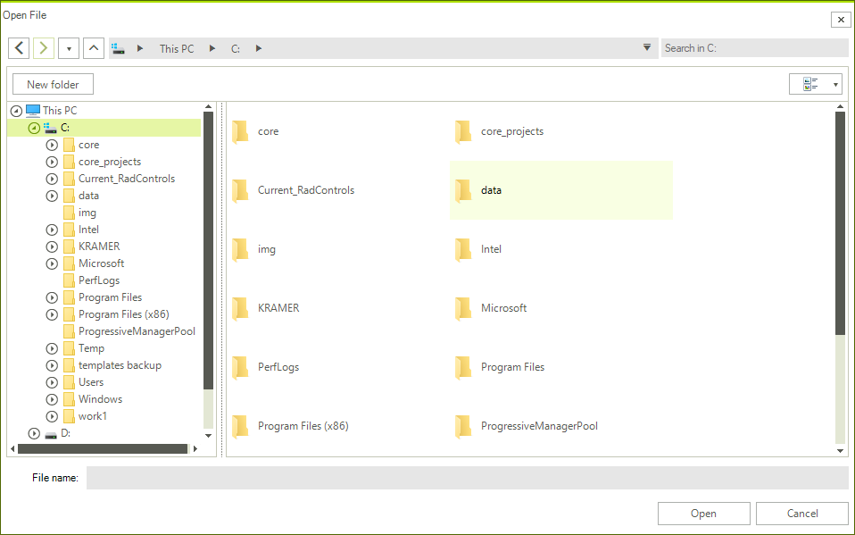
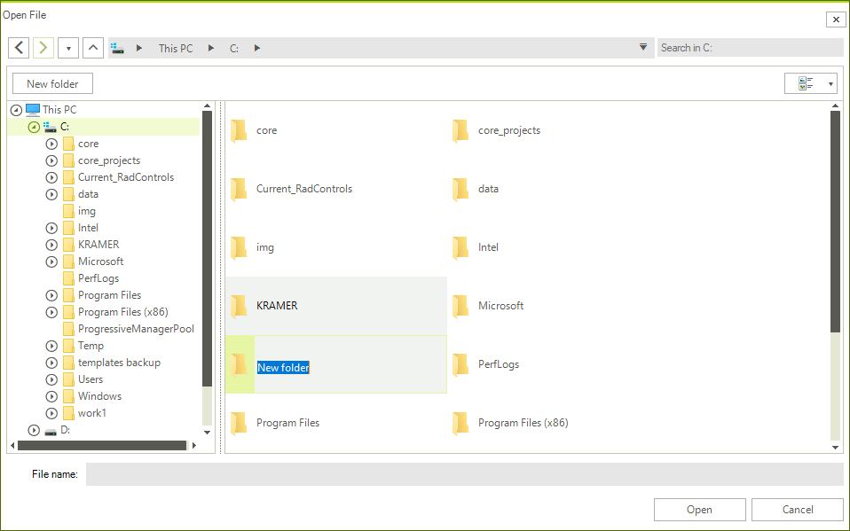
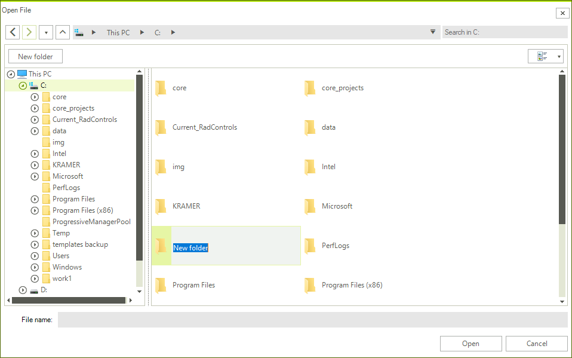
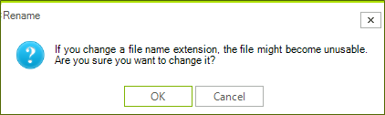
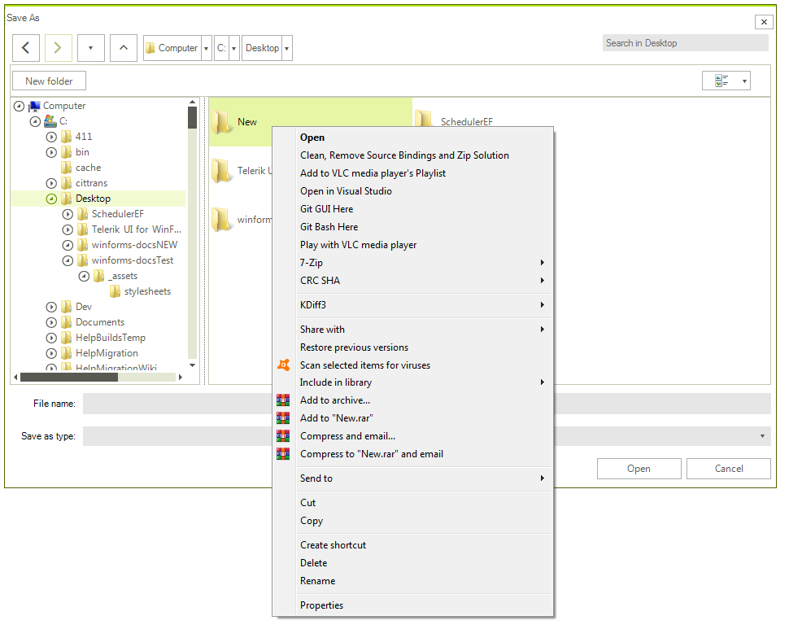
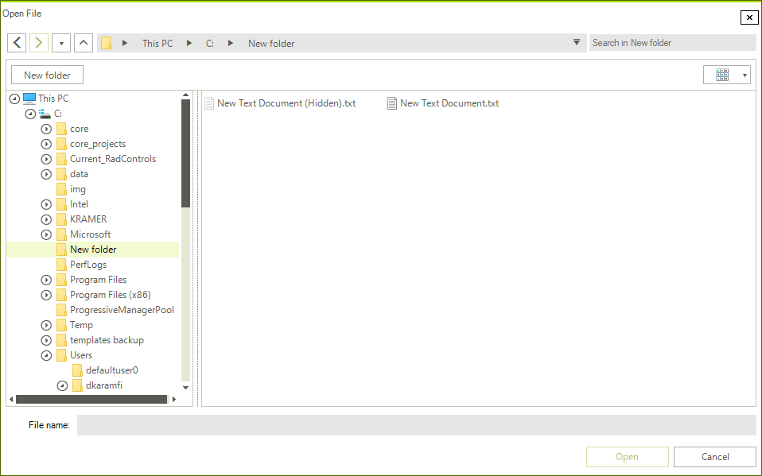

#  Common

This articles shows the features shared between all file dialogs controls -  **RadOpenFileDialog, RadSaveFileDialog, RadOpenFolderDialog** and **ExplorerControl** .

* [Setting Initial Directory](#setting-initial-directory)
* [Setting the Initial Layout of the Tiles](#setting-the-initial-layout-of-the-tiles)
* [New Folder Button](#new-folder-button)
* [Edit Mode](#edit-mode)
* [Disable the Automatic Expanding to Current Directory](#disable-the-automatic-expanding-to-current-directory)
* [Show Hidden Files](#show-hidden-files)

## Setting Initial Directory

All the dialog controls expose an **InitialDirectory** property that determines the directory that will be opened when the dialog shows.
        
####  Example 1: Setting initial directory

````C#

RadSaveFileDialog saveFileDialog = new RadSaveFileDialog(); 
saveFileDialog.InitialDirectory = @"C:\TEMP\"; 
DialogResult dr = saveFileDialog.ShowDialog(); 

````
````VB.NET

Dim saveFileDialog As RadSaveFileDialog = New RadSaveFileDialog()
saveFileDialog.InitialDirectory = "C:\TEMP\"
Dim dr As DialogResult = saveFileDialog.ShowDialog()

````

## Setting the Initial Layout of the Tiles

All the dialog controls expose an **InitialSelectedLayout** property that determines the initial layout of the list with the files.

####  Example 2: Setting initial layout 

````C#
RadSaveFileDialog saveFileDialog = new RadSaveFileDialog();
saveFileDialog.InitialSelectedLayout = LayoutType.Tiles; 
DialogResult dr = saveFileDialog.ShowDialog(); 

````
````VB.NET
Dim saveFileDialog As RadSaveFileDialog = New RadSaveFileDialog()
saveFileDialog.InitialSelectedLayout = LayoutType.Tiles
Dim dr As DialogResult = saveFileDialog.ShowDialog()

````

>caption Figure 1: RadOpenFileDialog in Tile view mode

 

The layout is determined by the LayoutType enum that provides the following modes:

* **SmallIcons**

* **MediumIcons**

* **LargeIcons**

* **ExtraLargeIcons**

* **List**

* **Tiles**

* **Details**

## New Folder Button

You can add a new folder in all the dialog controls with the **New Folder** button. The created folder enters edit mode in all [Layout View Modes](#setting-the-initial-layout-of-the-tiles). 

>caption Figure 2: New Folder Button and New Folder

 

## Edit Mode

In order to edit the selected file/folder, you can press the `F2` key. Alternatively, you can click on the text block which holds the file/folder name in all layouts except the *Details* layout where you can click on the cell holding the file/folder name. If you try to add a reserved character in a file/folder name, you will receive the warning illustrated in Figure 3:

>caption Figure 3: Reserved Character Warning 

 

Trying to change the file extension prompts the message box shown in Figure 4:

>caption Figure 4: Changing File Extension Message Box 

 

## Using the ContextMenu

**RadFileDialogs** has a **ContextMenu**. The well-known **ContextMenu** used in Windows is used for this purpose. It is available for the **RadListView** and **RadTreeView** components used in the Main Pane.

>caption Figure 5: Showing the ContextMenu

 

## Disable the Automatic Expanding to Current Directory

By default the main pane with the files/folders and the navigation tree are synced and when you navigate through the folders the selection in the tree navigation pane will also be updated. To disable this you can set the **ExpandToCurrentDirectory** property of the dialog to *False*.

####  Example 3: Disabling the automatic expanding to current directory  

````C#
RadOpenFileDialog openFileDialog = new RadOpenFileDialog();
openFileDialog.ExpandToCurrentDirectory = false;
DialogResult dr = openFileDialog.ShowDialog();


````
````VB.NET
Dim openFileDialog As RadOpenFileDialog = New RadOpenFileDialog()
openFileDialog.ExpandToCurrentDirectory = False
Dim dr As DialogResult = openFileDialog.ShowDialog()

````

>note When enabled the automatic expanding always synchronizes the files/folders list with the navigation tree. If you want to sync them only on load of the control, you can skip setting the property initially and then subscribe to the **Loaded** event of the dialog. In the event handler you can set the **ExpandToCurrentDirectory** property to *False*.

## Show Hidden Files

By default the file dialogs don't show hidden files and folders. To show them you can set the **ShowHiddenFiles** property of the corresponding file dialog control to *True*.

####  Example 4:  

````C#
RadOpenFileDialog openFileDialog = new RadOpenFileDialog(); 
openFileDialog.ShowHiddenFiles = true; 
DialogResult dr = openFileDialog.ShowDialog(); 

````
````VB.NET
Dim openFileDialog As RadOpenFileDialog = New RadOpenFileDialog()
openFileDialog.ShowHiddenFiles = True
Dim dr As DialogResult = openFileDialog.ShowDialog()

````

>caption Figure 6: Showing Hidden Files 

 

# See Also

* [Structure]()
* [Network Locations]()
* [Filterng]() 
* [Error Handling]()
* [Explorer Control]()
* [RadOpenFileDialog]()
* [RadOpenFolderDialog]()
* [RadSaveFileDialog]()
