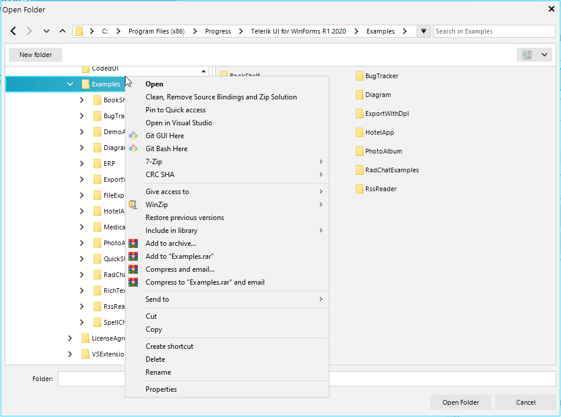

# Context Menu

Similar to Windows FileExplorer, the Telerik **ExplorerControl** also shows the standard Windows context menu:

>important You cannot modify files/folders context menu but you can choose to cancel its opening or modify the empty space context menu items.

The **ShellContextMenuOpening** event occurs when the context menu is about to open. You can use it to cancel the menu opening or to add/remove options from the short menu (the one opened when the cursor is on an empty space in the explorer).

#### Modify ShellContextMenu

<snippet id='file-dialogs-editing-options-menu-cs' />
<snippet id='file-dialogs-editing-options-menu-vb' />

