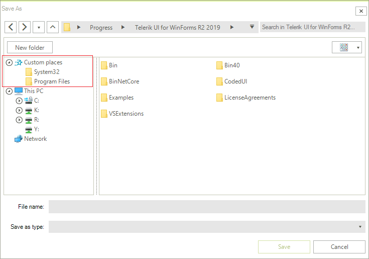

#  Custom Places

File dialogs provide you with the option to specify a list of directories to be displayed to the left of the Main Pane above the Tree Navigation Pane similarly to Windows' Quick Access view.

To enable this functionality, you should add a list of directories to the control's **CustomPlaces** collection. It is of type **IList**.

#### Defining custom places


````C#

RadSaveFileDialog saveFileDialog = new RadSaveFileDialog(); 
saveFileDialog.CustomPlaces.Add(@"C:\Windows\System32");
saveFileDialog.CustomPlaces.Add(@"C:\Program Files\");
saveFileDialog.ShowDialog();
       

````
````VB.NET

Dim saveFileDialog As RadSaveFileDialog = New RadSaveFileDialog()
saveFileDialog.CustomPlaces.Add("C:\Windows\System32")
saveFileDialog.CustomPlaces.Add("C:\Program Files\")
saveFileDialog.ShowDialog()


```` 

>note Note that this collection is read-only - you can only add and/or remove items from it but you cannot replace it with another collection.

The specified folders will then appear in the dialogs navigation pane.

>caption Custom directories shown in the navigation pane



# See Also

* [Structure]()
* [Network Locations]()
* [Filterng]() 
* [Error Handling]()
* [Explorer Control]()
* [RadOpenFileDialog]()
* [RadOpenFolderDialog]()
* [RadSaveFileDialog]()
