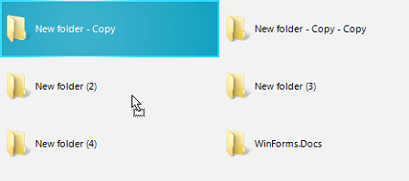
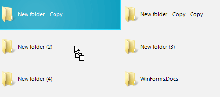

# WinForms FileDialogs Overview

The drag and drop feature of the file dialogs allows you to grab items (file and folders) and move them to a different location. The feature supports copy and move operations and it is enabled by default. 

#### Figure 1: Drag-Drop Files

 

The dialog gives you the ability to drag and drop in the main pane and the tree navigation pane, and also between them.

## Copy Drag vs. Move Drag

The default drag operation is move, except you drag an item to another drive. So, if you drag a file/folder and then drop it, the item will be moved to the new location. To start a copy drag you will need to press and hold the __Ctrl__ modifier key.

Dragging an item to another drive will copy it there. To change the operation you can hold the __Shift__ key while dropping.

> You can also alter between copy and move in the middle of the drag/drop operation by pressing Ctrl. In other words, you can start dragging without pressing the Ctrl key, and just before drop you can press the key, thus changing the type of the operation.

## Enable and Disable Drag and Drop

To enable or disable the feature you can use the __IsDragDropEnabled__ property of the file dialog.

#### Example 1: Disabling drag and drop

````C#

RadSaveFileDialog saveFileDialog = new RadSaveFileDialog();		
saveFileDialog.SaveFileDialogForm.ExplorerControl.IsDragDropEnabled = false;	
saveFileDialog.ShowDialog();	
		

````
````VB.NET

Dim saveFileDialog As RadSaveFileDialog = New RadSaveFileDialog()
saveFileDialog.SaveFileDialogForm.ExplorerControl.IsDragDropEnabled = False
saveFileDialog.ShowDialog()

````

## See Also  
* [Getting Started]()
