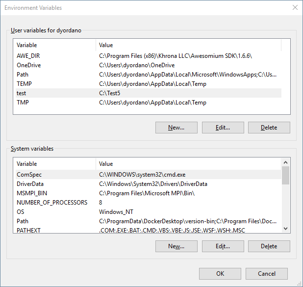
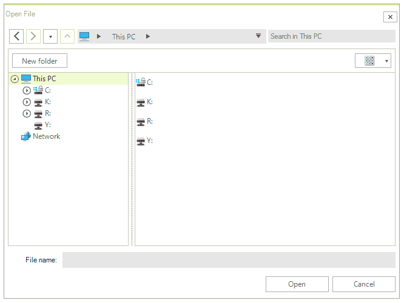

#  Environment Variables

**RadFileDialogs** provide out of the box support for the most common system environment variables that refer to well known directories in the Windows file system, as well as, to any user defined variables. This article will showcase the common behavior that all file dialogs share with regards to environment variables and also the differences between them.

>note When adding a new environment variable, you have to restart the application (if you started it from the .exe file). This is needed in order to get the new environment variables from Windows. If the application is started from Visual Studio, a restart of Visual Studio is required.

## Common Behavior

>note The examples in this section assume that you have an environment variable defined, named "test" with a value of "C:&#92;Test5".

When typing an environment variable in the Path Navigation Pane of the file dialogs and typing enter, the Tree Navigation Pane will navigate to the respective directory. Figure 1 demonstrates what will happen when typing %test% in the Path Navigation Pane.

>caption Figure 1: Typing an environment variable in the breadcrumb

When typing an enviroment variable followed by "\" in the Path Navigation Pane, the suggestions list containing all of the child folders of the current directory will be listed. When doing the same in the Operations Pane, all child folders and files will be listed. This is demonstrated in Figure 2.

>caption Figure 2: Listing all child files/folders in an environment variable directory from breadcrumb and autocomplete

>note If you type %invalid% and hit enter, assuming that you have not defined an environment variable named "invalid", an **InvalidOperationException** will be thrown and the OpenFileDialogForm.ExplorerControl.PathNavigationBreadCrumb.**ExceptionRaised** event will be raised. If the environment variable returns a valid path to a file, the file will be opened using the corresponding Windows program.

## Different Behavior

Depending on whether the environment variable points to a folder or a file, the different **RadFileDialogs** have different behavior.

* **Environment variables that point to files**

	When typing an environment variable which points to a file in the Operations Pane, the **RadOpenFileDialog**'s Open button will be enabled. If you click it, the respective name of the file will be returned. As for the **RadSaveFileDialog**, when clicking the Save button, an attempt will be made to override the file and a message box will appear for confirmation. In the **RadOpenFolderDialog**, when typing an environment variable which points to a file, the Open Folder button will remain disabled.

* **Environment variables that point to folders**

	In both the **RadOpenFileDialog** and the **RadSaveFileDialog**, when typing an environment variable that points to a folder in the Operations Pane, the Tree Navigation Pane will navigate to the respective directory. In the same case the **RadOpenFolderDialog** will have its Open Folder button enabled and if clicked, it will return the FileName, FileNames and SafeFileNames of the respective directory.

## Common Windows Environment Variables

* **ComSpec**: Typing this environment variable and hitting enter will open the terminal.

* **windir**: Typing "%windir%/", followed by a valid path is a supported scenario.

* **USERNAME**: It is possible to include an environment variable in the middle of a file path. "C:\Users\%USERNAME%\", followed by a valid path is a supported scenario.

* **userdomain**: When typing this environment variable and hitting enter, an **InvalidOperationException** will be thrown and the [ExceptionRaised](%slug winforms/file-dialogs/features/error-handling%) event will be raised, since this environment variable does not point to a file or folder.

The examples above assume that the default paths of the listed system environment variables have not been changed.

# See Also

* [Structure]()
* [Network Locations]()
* [Filterng]() 
* [Error Handling]()
* [Explorer Control]()
* [RadOpenFileDialog]()
* [RadOpenFolderDialog]()
* [RadSaveFileDialog]()