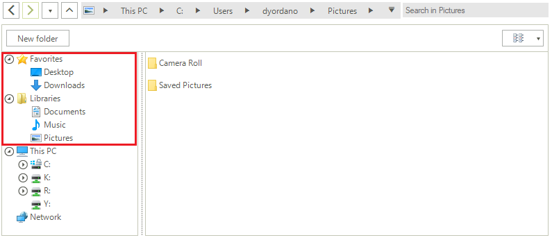

#  Favorites and Libraries Nodes

As of **R3 2019** File Dialogs allow defining [custom places]() to be displayed on the left side of the **ExplorerControl**'s Main Pane. It is also possible to add multiple custom places like favorites and libraries nodes:



This will give you quick access to the custom-defined folders. Once a node in the *Favorites/Libraries* section is clicked, the respective folder is selected under *This PC*.

#### Defining Multiple Custom Places: Favorites and Libraries Nodes


````C#

List<string> paths = new List<string>()
{
    @"C:\Users\"your_user_name"\Desktop",
    @"C:\Users\"your_user_name"\Downloads", 
};

Image favoritesIcon = Properties.Resources.Favorites;
explorerControl1.AddCustomPlacesNode("Favorites", favoritesIcon, paths);

paths = new List<string>()
{
    @"C:\Users\"your_user_name"\Documents",
    @"C:\Users\"your_user_name"\Music", 
    @"C:\Users\"your_user_name"\Pictures"
};

Image folderIcon = Properties.Resources.Folder;
explorerControl1.AddCustomPlacesNode("Libraries", folderIcon, paths);


````
````VB.NET
Dim paths As List(Of String) = New List(Of String)() From {
    "C:\Users\"your_user_name"\Desktop",
    "C:\Users\"your_user_name"\Downloads"
}
Dim favoritesIcon As Image = My.Resources.Favorites
Me.ExplorerControl1.AddCustomPlacesNode("Favorites", favoritesIcon, paths)
paths = New List(Of String)() From {
    "C:\Users\"your_user_name"\Documents",
    "C:\Users\"your_user_name"\Music",
    "C:\Users\"your_user_name"\Pictures"
}
Dim folderIcon As Image = My.Resources.Folder
Me.ExplorerControl1.AddCustomPlacesNode("Libraries", folderIcon, paths)

 
````


# See Also

* [Structure]()
* [Network Locations]()
* [Filterng]() 
* [Error Handling]()
* [Explorer Control]()
* [RadOpenFileDialog]()
* [RadOpenFolderDialog]()
* [RadSaveFileDialog]()
