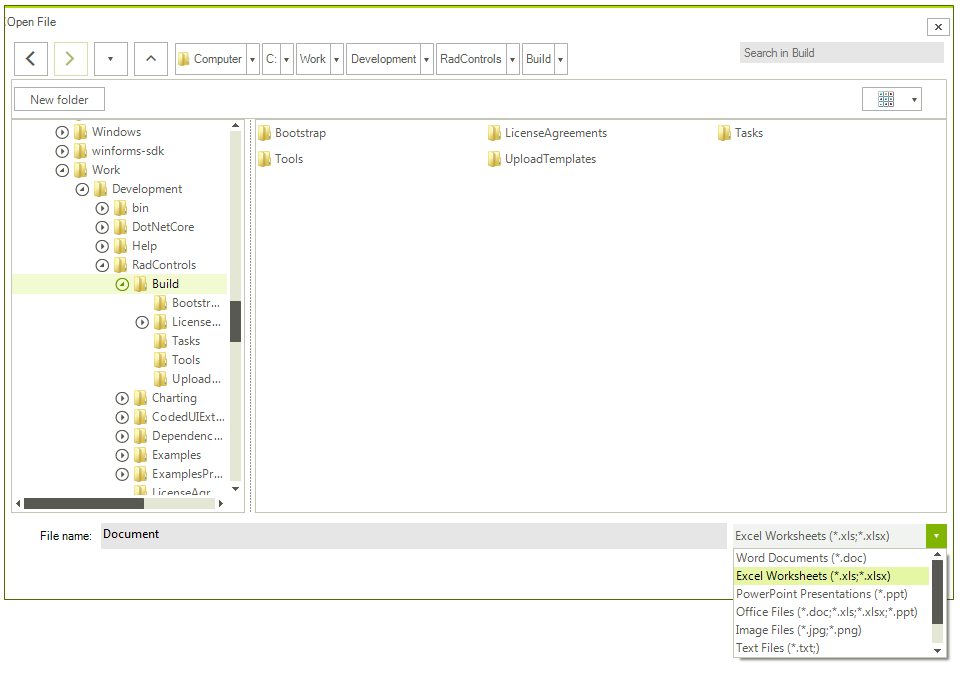
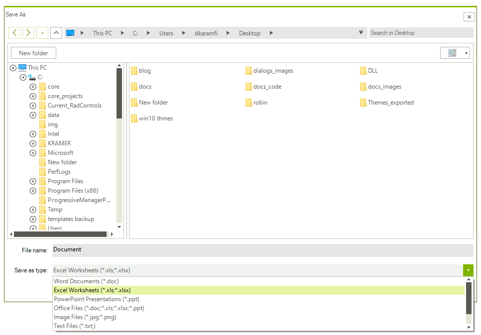

# Filtering

You can specify a filter for the **RadOpenFileDialog** and **RadSaveFileDialog** dialogs in order to indicate to the user which types of files should be opened or saved. To enable this functionality you can set the **Filter** and **FilterIndex** properties.

The **Filter** is a property of type string that determines what file extensions should be used in the drop-down. On the other hand, the **FilterIndex** property can be used to get or set the index of the filter currently selected in a file dialog.

>important The index value of the first filter entry is 1.

The string set to the **Filter** property is parsed in a strict way. So when parsing is not successful, the following **ArgumentException** is thrown:

>important ***Provided filter string is not valid. Filter string should contain a description of the filter, followed by a vertical bar and the filter pattern. Must also separate multiple filter description and pattern pairs by a vertical bar. Must separate multiple extensions in a filter pattern with a semicolon. Example: "Image files (*.bmp, *.jpg)|*.bmp;*.jpg|All files (*.*)|*.*"***

## Filter in RadOpenFileDialog

To set a filter for the **RadOpenFileDialog** dialog you can set the **Filter** property. When this property is not set the drop-down will not appear.

####  Example 1: Set Filter property of RadOpenFileDialog 

````C#
RadOpenFileDialog openFileDialog = new RadOpenFileDialog();
openFileDialog.FileName = "Document";
openFileDialog.Filter = "Word Documents|*.doc|Excel Worksheets|*.xls;*.xlsx|" +
                        "PowerPoint Presentations|*.ppt" +
                        "|Office Files|*.doc;*.xls;*.xlsx;*.ppt" +
                        "|Image Files|*.jpg;*.png" +
                        "|Text Files|*.txt;" +
                        "|Archives Files|*.zip;*.rar" +
                        "|All Files|*.*";
openFileDialog.FilterIndex = 2;
openFileDialog.ShowDialog();


````
````VB.NET
Dim openFileDialog As RadOpenFileDialog = New RadOpenFileDialog()
openFileDialog.FileName = "Document"
openFileDialog.Filter = "Word Documents|*.doc|Excel Worksheets|*.xls;*.xlsx|" & "PowerPoint Presentations|*.ppt" & "|Office Files|*.doc;*.xls;*.xlsx;*.ppt" & "|Image Files|*.jpg;*.png" & "|Text Files|*.txt;" & "|Archives Files|*.zip;*.rar" & "|All Files|*.*"
openFileDialog.FilterIndex = 2
openFileDialog.ShowDialog()

````

>caption Figure 1: Filter drop-down visualization in RadOpenFileDialog 

 

## Filter in RadSaveFileDialog

To set a filter for the **RadSaveFileDialog** dialog you can set the **Filter** property. When this property is not set the drop-down will appear but will be empty.

>important Note that the **Filter** property does not only filter the files in the main pane but also determines the type of the file which will be saved.

####  Example 2: Set Filter property of RadSaveFileDialog 

````C#
RadSaveFileDialog saveFileDialog = new RadSaveFileDialog(); 
saveFileDialog.FileName = "Document"; 
saveFileDialog.Filter = "Word Documents|*.doc|Excel Worksheets|*.xls;*.xlsx|" +
                        "PowerPoint Presentations|*.ppt" +
                        "|Office Files|*.doc;*.xls;*.xlsx;*.ppt" +
                        "|Image Files|*.jpg;*.png" +
                        "|Text Files|*.txt;" +
                        "|Archives Files|*.zip;*.rar" +
                        "|All Files|*.*"; 
saveFileDialog.FilterIndex = 2; 
saveFileDialog.ShowDialog(); 

````
````VB.NET
    Dim saveFileDialog As RadSaveFileDialog = New RadSaveFileDialog()
    saveFileDialog.FileName = "Document"
    saveFileDialog.Filter = "Word Documents|*.doc|Excel Worksheets|*.xls;*.xlsx|" & "PowerPoint Presentations|*.ppt" & "|Office Files|*.doc;*.xls;*.xlsx;*.ppt" & "|Image Files|*.jpg;*.png" & "|Text Files|*.txt;" & "|Archives Files|*.zip;*.rar" & "|All Files|*.*"
    saveFileDialog.FilterIndex = 2
    saveFileDialog.ShowDialog()

````

>caption Figure 2: Filter drop-down visualization in RadSaveFileDialog

 