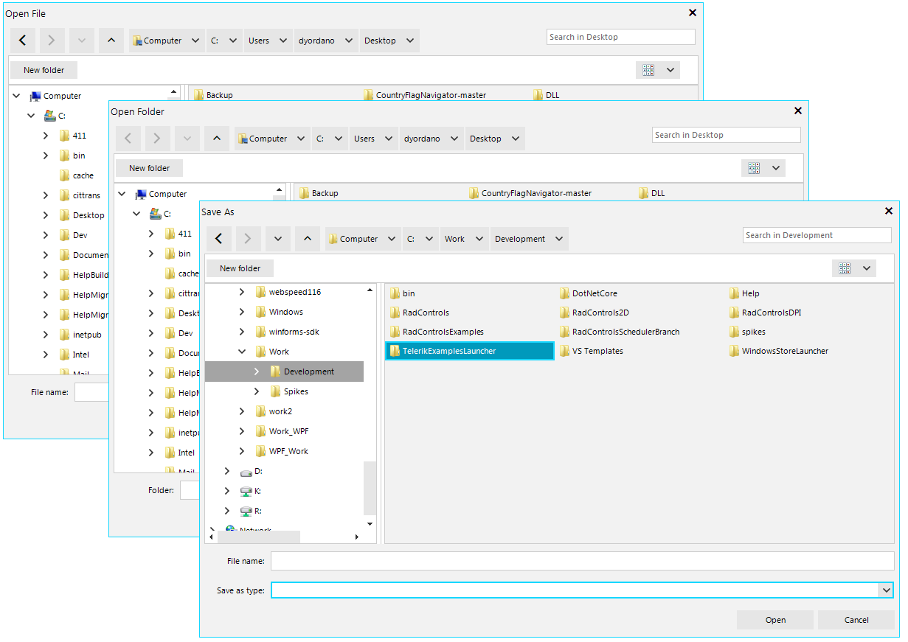

#  File Dialogs

Telerik UI for WinForms features the three most commonly used file and folder manipulation dialogs — Open File Dialog, Save File Dialog and Open Folder Dialog, all of which are fully themable delivering consistent look and feel across the application. They can come really handy if you are looking for a more appealing UI and want to replace the standard MS file dialogs with a modern design and user experience.

 

## Key Features

Here are a few of the controls' main features:

* Easy Navigation: The dialogs allow you to easily browse through your file system either through the tree-view-like navigation pane or the breadcrumb/path pane. A history of the visited folders is kept so that you can seamlessly jump back and forth between folders.

* Search: The out-of-the-box search functionality allows you to quickly find just the files and folders you're looking for by using the Windows Search index when available. It is supported with .NET 4.0 target framework or higher.

* Customizable Layouts: The controls also provide you with an API to set an initial directory, specify custom folders to be displayed top-most in the navigation pane and switch between different view modes (tiles, small icons, large icons, etc.).

* Variety of Themes: You can persist the appearance throughout your application by applying any of the predefined themes provided by the UI for WinForms suite to your dialogs.

* Keyboard Navigation Support: You can easily navigate through the tree-view-like navigation pane, the breadcrumb/path pane and the files in all layouts by just pressing the arrow keys on your keyboard.

* Windows File System Synchronization: The dialogs provide seemless synchronization with the Windows File System. Adding, renaming or deleting operations on files are reflected in the dialogs instantly.

* New Folder Functionality: You can add a new folder in all dialogs with the New Folder button.

* Context Menu: The dialogs use the well-known Windows context menu.

* Editing: The controls provide file and folder names editing via the F2 key or mouse click.

* Touch Support: The dialogs also provide out-of-the-box touch support.

* Drive/Directory Filtering: You can filter all drives and directories with the **DirectoryRequesting** event.

* Network Locations: The controls allow you to display network locations by setting the ShowNetworkLocations property.

The file dialogs also support many other features of the native Windows file dialogs.
 
        
