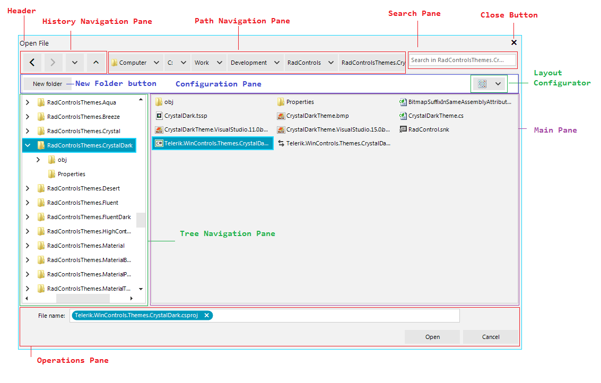

# Structure 

This article describes the inner structure and organization of the elements which build **RadOpenFileDialog**, **RadSaveFileDialog** and **RadOpenFolderDialog**.

 

* **Header**: Displays the content specified by the **OpenFileDialogHeader** string in the **FileDialogsLocalizationProvider**. 

* **Close Button**: The button which closes the file dialog.

* **History Navigation Pane**: Represents the controls used to navigate through the browse history.

* **Path Navigation Pane**: The breadcrumb control used to select a particular directory.

* **Search Pane**: Consists of a **RadTextBox** in which the user can enter the search criteria and a button to clear the inserted text.

* **Configuration Pane**: The pane where the layout configurator is placed in.

* **New Folder Button**: The button for creating a new folder.

* **Layout Configurator**: Represents a **RadDropDownButton** to select the view mode to be used in the main pane.

* **Tree Navigation Pane**: The **RadTreeView** used to navigate through the directories.

* **Main Pane**: Uses a **RadListView** to display all files and/or folders in the current directory after the search filters (if any) have been applied. This view depends on the layout selected in the layout configurator drop down.

* **Operations Pane**: Consist of a **RadAutoCompleteBox** where the currently selected item(s) are displayed and can be set and the operation buttons for the given dialog.

* **Extensions Filter DropDown**: Displays all file extensions added with the **Filter** property to the **RadOpenFileDialog** and **RadSaveFileDialog** controls in order to indicate to the user which types of files should be opened or saved.

# See Also

* [Overview]() 
* [Getting Started]()
