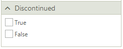
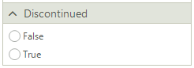
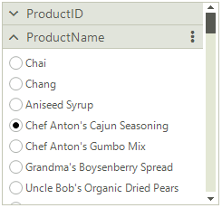
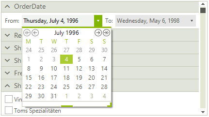
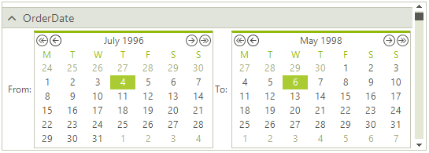

# Changing Default Editors

**RadFilterView** is built of different filter view group elements. The control uses a **FilterViewCategoriesFactory** that creates the necessary category element considering the property data type:

* **FilterViewNumericCategoryElement**: used for numeric types. It generates two RadSpinEditorElements allowing you to specify a range of numeric values. A RadTrackBarElement is also created providing a different user experience for defining a numeric range. 
* **FilterViewDateTimeCategoryElement**: used for DateTime properties. It generates two RadDateTimePickerElements allowing you to specify a date range. 
* **FilterViewBooleanCategoryElement**: used for boolean fields. Two RadCheckBoxElements are created allowing you to easily filter by True/False values. 
* **FilterViewTextCategoryElement**: default category element. It generates a set of check boxes for each string value. 

**RadFilterView** offers a convenient API for customizing the automatically generated editor elements for a certain group. The default category element can be customized either by utilizing the **FilterViewCategoriesFactory** or by handling the **CategoryCreating** event.  

## Using the CategoryCreating Event

### Replace FilterViewBooleanCategoryElement with FilterViewTextCategoryElement

For the boolean fields in the applied DataSource, **RadFilterView** generates a **FilterViewBooleanCategoryElement**. It contains a group of two check boxes, true/false:



The **CategoryCreating** event gives you the possibility to replace the default **FilterViewBooleanCategoryElement** with another one, e.g. **FilterViewTextCategoryElement** with radio buttons:

{{source=..\SamplesCS\FilterView\FilterViewGettingStarted.cs region=ReplaceCategory}} 
{{source=..\SamplesVB\FilterView\FilterViewGettingStarted.vb region=ReplaceCategory}} 

````C#

private void RadFilterView_CategoryCreating(object sender, FilterViewCategoryCreatingEventArgs e)
{
    if (e.Category.PropertyName == "Discontinued")
    {
        FilterViewTextCategoryElement textCategory = new FilterViewTextCategoryElement();
        textCategory.PropertyName = e.Category.PropertyName;
        textCategory.ItemType = FilterViewTextCategoryItemType.RadioButton;
        e.Category = textCategory;
    }
}

````
````VB.NET

Private Sub RadFilterView_CategoryCreating(ByVal sender As Object, ByVal e As FilterViewCategoryCreatingEventArgs)
    If e.Category.PropertyName = "Discontinued" Then
        Dim textCategory As FilterViewTextCategoryElement = New FilterViewTextCategoryElement()
        textCategory.PropertyName = e.Category.PropertyName
        textCategory.ItemType = FilterViewTextCategoryItemType.RadioButton
        e.Category = textCategory
    End If
End Sub

````

{{endregion}}   



### Change the default ItemType for FilterViewTextCategoryElement

By default, the **FilterViewTextCategoryElement** auto-generates a set of check boxes for each string value. You can switch to creating a set of radio buttons and thus allowing only a single text value to be selected:

{{source=..\SamplesCS\FilterView\FilterViewGettingStarted.cs region=SwitchToRadioButtons}} 
{{source=..\SamplesVB\FilterView\FilterViewGettingStarted.vb region=SwitchToRadioButtons}} 

````C#

private void RadFilterView1_CategoryCreating(object sender, FilterViewCategoryCreatingEventArgs e)
{
    if (e.Category.PropertyName == "ProductName")
    {
        FilterViewTextCategoryElement textCategory = e.Category as FilterViewTextCategoryElement; 
        textCategory.ItemType = FilterViewTextCategoryItemType.RadioButton; 
    }
}

````
````VB.NET

Private Sub RadFilterView1_CategoryCreating(ByVal sender As Object, ByVal e As FilterViewCategoryCreatingEventArgs)
    If e.Category.PropertyName = "ProductName" Then
        Dim textCategory As FilterViewTextCategoryElement = TryCast(e.Category, FilterViewTextCategoryElement)
        textCategory.ItemType = FilterViewTextCategoryItemType.RadioButton
    End If
End Sub

````

{{endregion}}   



### Customize FilterViewDateTimeCategoryElement

Another case is to replace the default editor controls with more appropriate ones. For example, the **FilterViewDateTimeCategoryElement** generates two **RadDateTimePicker** controls:



You may want to replace them with two **RadCalendar** controls. The following example demonstrates how to do it:



{{source=..\SamplesCS\FilterView\FilterViewGettingStarted.cs region=CalendarCategory}} 
{{source=..\SamplesVB\FilterView\FilterViewGettingStarted.vb region=CalendarCategory}} 

````C#
public class FilterViewCalendarCategoryElement : FilterViewDateTimeCategoryElement
{

    RadCalendar minValueCalendar;
    RadCalendar maxValueCalendar;

    public FilterViewCalendarCategoryElement(string propertyName) : base(propertyName)
    {

    }

    protected override void CreateChildElements()
    {
        base.CreateChildElements();
        this.MinValueDateTimePicker.Visibility = ElementVisibility.Collapsed;
        this.MaxValueDateTimePicker.Visibility = ElementVisibility.Collapsed;
        this.minValueCalendar = new RadCalendar();
        minValueCalendar.AllowMultipleSelect = false;
        this.minValueCalendar.SelectedDate = this.minValue;
        RadHostItem minHost = new RadHostItem(this.minValueCalendar);
        minHost.MinSize = new Size(0, 150);
        this.minValueCalendar.SelectionChanged += Calendar_SelectionChanged;
        this.minValueCalendar.Margin = new Padding(2);
        this.EditorsStack.Children.Insert(1, minHost);
        this.minValueCalendar.SelectedDate = this.minValue;

        this.maxValueCalendar = new RadCalendar();
        maxValueCalendar.AllowMultipleSelect = false;
        this.maxValueCalendar.SelectedDate = this.maxValue;
        this.maxValueCalendar.SelectionChanged += Calendar_SelectionChanged;
        RadHostItem maxHost = new RadHostItem(this.maxValueCalendar);
        maxHost.MinSize = new Size(0, 150);
        maxHost.StretchHorizontally = true;
        this.maxValueCalendar.Margin = new Padding(2);
        this.EditorsStack.Children.Add(maxHost);
    }

    protected override void DisposeManagedResources()
    {
        base.DisposeManagedResources();
        this.minValueCalendar.SelectionChanged -= Calendar_SelectionChanged;
        this.maxValueCalendar.SelectionChanged -= Calendar_SelectionChanged;
    }
    public override void CreateItems(ICollection<object> values)
    {
        base.CreateItems(values);
        this.minValueCalendar.SelectionChanged -= Calendar_SelectionChanged;
        this.maxValueCalendar.SelectionChanged -= Calendar_SelectionChanged;
        minValueCalendar.SelectedDate = this.minValue;
        minValueCalendar.FocusedDate = this.minValue;
        maxValueCalendar.SelectedDate = this.maxValue;
        maxValueCalendar.FocusedDate = this.maxValue;
        this.minValueCalendar.SelectionChanged += Calendar_SelectionChanged;
        this.maxValueCalendar.SelectionChanged += Calendar_SelectionChanged;
    }

    private void Calendar_SelectionChanged(object sender, EventArgs e)
    {
        this.ItemFilterChanged(null);
    }

    protected override DateTime? GetMinEditorValue()
    {
        return this.minValueCalendar.SelectedDate;
    }

    protected override DateTime? GetMaxEditorValue()
    {
        return this.maxValueCalendar.SelectedDate;
    }

    protected override void SetMinEditorValue(DateTime? newValue)
    {
        base.SetMinEditorValue(newValue);
        if (newValue != null)
        {
            this.minValueCalendar.SelectedDate = (DateTime)newValue;
            this.minValueCalendar.FocusedDate = this.minValueCalendar.SelectedDate;
        }
    }

    protected override void SetMaxEditorValue(DateTime? newValue)
    {
        base.SetMaxEditorValue(newValue);
        if (newValue != null)
        {
            this.maxValueCalendar.SelectedDate = (DateTime)newValue;
            this.maxValueCalendar.FocusedDate = this.maxValueCalendar.SelectedDate;
        }
    }
}


````
````VB.NET

Public Class FilterViewCalendarCategoryElement
    Inherits FilterViewDateTimeCategoryElement

    Private minValueCalendar As RadCalendar
    Private maxValueCalendar As RadCalendar

    Public Sub New(ByVal propertyName As String)
        MyBase.New(propertyName)
    End Sub

    Protected Overrides Sub CreateChildElements()
        MyBase.CreateChildElements()
        Me.MinValueDateTimePicker.Visibility = ElementVisibility.Collapsed
        Me.MaxValueDateTimePicker.Visibility = ElementVisibility.Collapsed
        Me.minValueCalendar = New RadCalendar()
        minValueCalendar.AllowMultipleSelect = False
        Me.minValueCalendar.SelectedDate = Me.minValue
        Dim minHost As RadHostItem = New RadHostItem(Me.minValueCalendar)
        minHost.MinSize = New Size(0, 150)
        AddHandler Me.minValueCalendar.SelectionChanged, AddressOf Calendar_SelectionChanged
        Me.minValueCalendar.Margin = New Padding(2)
        Me.EditorsStack.Children.Insert(1, minHost)
        Me.minValueCalendar.SelectedDate = Me.minValue
        Me.maxValueCalendar = New RadCalendar()
        maxValueCalendar.AllowMultipleSelect = False
        Me.maxValueCalendar.SelectedDate = Me.maxValue
        AddHandler Me.maxValueCalendar.SelectionChanged, AddressOf Calendar_SelectionChanged
        Dim maxHost As RadHostItem = New RadHostItem(Me.maxValueCalendar)
        maxHost.MinSize = New Size(0, 150)
        maxHost.StretchHorizontally = True
        Me.maxValueCalendar.Margin = New Padding(2)
        Me.EditorsStack.Children.Add(maxHost)
    End Sub

    Protected Overrides Sub DisposeManagedResources()
        MyBase.DisposeManagedResources()
        RemoveHandler Me.minValueCalendar.SelectionChanged, AddressOf Calendar_SelectionChanged
        RemoveHandler Me.maxValueCalendar.SelectionChanged, AddressOf Calendar_SelectionChanged
    End Sub

    Public Overrides Sub CreateItems(ByVal values As ICollection(Of Object))
        MyBase.CreateItems(values)
        RemoveHandler Me.minValueCalendar.SelectionChanged, AddressOf Calendar_SelectionChanged
        RemoveHandler Me.maxValueCalendar.SelectionChanged, AddressOf Calendar_SelectionChanged
        minValueCalendar.SelectedDate = Me.minValue
        minValueCalendar.FocusedDate = Me.minValue
        maxValueCalendar.SelectedDate = Me.maxValue
        maxValueCalendar.FocusedDate = Me.maxValue
        AddHandler Me.minValueCalendar.SelectionChanged, AddressOf Calendar_SelectionChanged
        AddHandler Me.maxValueCalendar.SelectionChanged, AddressOf Calendar_SelectionChanged
    End Sub

    Private Sub Calendar_SelectionChanged(ByVal sender As Object, ByVal e As EventArgs)
        Me.ItemFilterChanged(Nothing)
    End Sub

    Protected Overrides Function GetMinEditorValue() As DateTime?
        Return Me.minValueCalendar.SelectedDate
    End Function

    Protected Overrides Function GetMaxEditorValue() As DateTime?
        Return Me.maxValueCalendar.SelectedDate
    End Function

    Protected Overrides Sub SetMinEditorValue(ByVal newValue As DateTime?)
        MyBase.SetMinEditorValue(newValue)

        If newValue IsNot Nothing Then
            Me.minValueCalendar.SelectedDate = CType(newValue, DateTime)
            Me.minValueCalendar.FocusedDate = Me.minValueCalendar.SelectedDate
        End If
    End Sub

    Protected Overrides Sub SetMaxEditorValue(ByVal newValue As DateTime?)
        MyBase.SetMaxEditorValue(newValue)

        If newValue IsNot Nothing Then
            Me.maxValueCalendar.SelectedDate = CType(newValue, DateTime)
            Me.maxValueCalendar.FocusedDate = Me.maxValueCalendar.SelectedDate
        End If
    End Sub
End Class


````

{{endregion}} 

Then, apply the custom category element in the **CategoryCreating** event:

{{source=..\SamplesCS\FilterView\FilterViewGettingStarted.cs region=CustomCategory}} 
{{source=..\SamplesVB\FilterView\FilterViewGettingStarted.vb region=CustomCategory}} 

````C#

private void RadFilterViewCategoryCreating(object sender, FilterViewCategoryCreatingEventArgs e)
{
    if (e.Category is FilterViewDateTimeCategoryElement)
    {
        FilterViewCalendarCategoryElement calendarCategory = new FilterViewCalendarCategoryElement(e.Category.PropertyName); 
        e.Category = calendarCategory;
    }
} 

````
````VB.NET

Private Sub RadFilterViewCategoryCreating(ByVal sender As Object, ByVal e As FilterViewCategoryCreatingEventArgs)
    If TypeOf e.Category Is FilterViewDateTimeCategoryElement Then
        Dim calendarCategory As FilterViewCalendarCategoryElement = New FilterViewCalendarCategoryElement(e.Category.PropertyName)
        e.Category = calendarCategory
    End If
End Sub

````

{{endregion}} 

>note It is possible to either use the **CategoryCreating** event or a custom **FilterViewCategoriesFactory** to replace one of the default category elements with your custom one.

## Using a Custom Factory

Create a derivative of the **FilterViewCategoriesFactory** element and override its **CreateCategory** method. This is the default logic for generating the category elements considering the property data type. It is possible to plug into the creation process and adjust it according to any custom requirements:

{{source=..\SamplesCS\FilterView\FilterViewGettingStarted.cs region=CustomFactory}} 
{{source=..\SamplesVB\FilterView\FilterViewGettingStarted.vb region=CustomFactory}} 

````C#
public class CustomFilterViewCategoriesFactory : Telerik.WinControls.UI.FilterView.FilterViewCategoriesFactory
{
    public override BaseFilterViewCategoryElement CreateCategory(string propertyName, Type propertyType, string displayName = "")
    {
        if (TelerikHelper.IsNumericType(propertyType))
        {
            return new FilterViewNumericCategoryElement(propertyName, propertyType, displayName);
        }
        else if (propertyType == typeof(DateTime))
        {
            return new FilterViewDateTimeCategoryElement(propertyName, propertyType, displayName);
        }
        else if (propertyType == typeof(bool))
        { 
            return new FilterViewBooleanCategoryElement(propertyName, propertyType, displayName);
        }

        return new FilterViewTextCategoryElement(propertyName, propertyType, displayName);
    }
}

````
````VB.NET

Public Class CustomFilterViewCategoriesFactory
    Inherits Telerik.WinControls.UI.FilterView.FilterViewCategoriesFactory

    Public Overrides Function CreateCategory(ByVal propertyName As String, ByVal propertyType As Type,
                                             ByVal Optional displayName As String = "") As BaseFilterViewCategoryElement
        If TelerikHelper.IsNumericType(propertyType) Then
            Return New FilterViewNumericCategoryElement(propertyName, propertyType, displayName)
        ElseIf propertyType = GetType(DateTime) Then
            Return New FilterViewDateTimeCategoryElement(propertyName, propertyType, displayName)
        ElseIf propertyType = GetType(Boolean) Then
            Return New FilterViewBooleanCategoryElement(propertyName, propertyType, displayName)
        End If

        Return New FilterViewTextCategoryElement(propertyName, propertyType, displayName)
    End Function
End Class

````

{{endregion}}  

Then, apply the custom factory: 

{{source=..\SamplesCS\FilterView\FilterViewGettingStarted.cs region=ChangeFactory}} 
{{source=..\SamplesVB\FilterView\FilterViewGettingStarted.vb region=ChangeFactory}} 

````C#

this.radFilterView1.CategoriesFactory = new CustomFilterViewCategoriesFactory();

````
````VB.NET
Me.RadFilterView1.CategoriesFactory = New CustomFilterViewCategoriesFactory()

````

{{endregion}}    
 
# See Also

* [Getting Started]()
* [Structure]()
 
        
