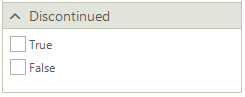
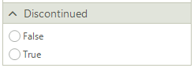
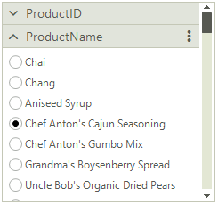
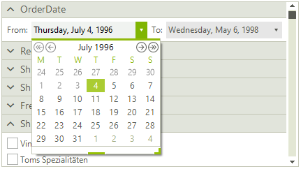
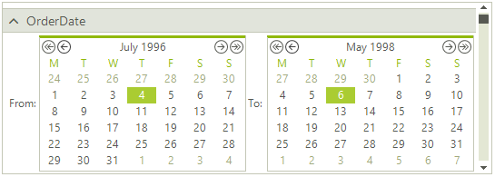

# Changing Default Editors

**RadFilterView** is built of different filter view group elements. The control uses a **FilterViewCategoriesFactory** that creates the necessary category element considering the property data type:

* **FilterViewNumericCategoryElement**: used for numeric types. It generates two RadSpinEditorElements allowing you to specify a range of numeric values. A RadTrackBarElement is also created providing a different user experience for defining a numeric range. 
* **FilterViewDateTimeCategoryElement**: used for DateTime properties. It generates two RadDateTimePickerElements allowing you to specify a date range. 
* **FilterViewBooleanCategoryElement**: used for boolean fields. Two RadCheckBoxElements are created allowing you to easily filter by True/False values. 
* **FilterViewTextCategoryElement**: default category element. It generates a set of check boxes for each string value. 

**RadFilterView** offers a convenient API for customizing the automatically generated editor elements for a certain group. The default category element can be customized either by utilizing the **FilterViewCategoriesFactory** or by handling the **CategoryCreating** event.  

## Using the CategoryCreating Event

### Replace FilterViewBooleanCategoryElement with FilterViewTextCategoryElement

For the boolean fields in the applied DataSource, **RadFilterView** generates a **FilterViewBooleanCategoryElement**. It contains a group of two check boxes, true/false:

The **CategoryCreating** event gives you the possibility to replace the default **FilterViewBooleanCategoryElement** with another one, e.g. **FilterViewTextCategoryElement** with radio buttons:

<snippet id='filter-view-changing-default-editors-replacecategory-cs' />
<snippet id='filter-view-changing-default-editors-replacecategory-vb' />

### Change the default ItemType for FilterViewTextCategoryElement

By default, the **FilterViewTextCategoryElement** auto-generates a set of check boxes for each string value. You can switch to creating a set of radio buttons and thus allowing only a single text value to be selected:

<snippet id='filter-view-changing-default-editors-switchtoradiobuttons-cs' />
<snippet id='filter-view-changing-default-editors-switchtoradiobuttons-vb' />

### Customize FilterViewDateTimeCategoryElement

Another case is to replace the default editor controls with more appropriate ones. For example, the **FilterViewDateTimeCategoryElement** generates two **RadDateTimePicker** controls:

You may want to replace them with two **RadCalendar** controls. The following example demonstrates how to do it:

<snippet id='filter-view-changing-default-editors-calendarcategory-cs' />
<snippet id='filter-view-changing-default-editors-calendarcategory-vb' />

Then, apply the custom category element in the **CategoryCreating** event:

<snippet id='filter-view-changing-default-editors-customcategory-cs' />
<snippet id='filter-view-changing-default-editors-customcategory-vb' />

>note It is possible to either use the **CategoryCreating** event or a custom **FilterViewCategoriesFactory** to replace one of the default category elements with your custom one.

## Using a Custom Factory

Create a derivative of the **FilterViewCategoriesFactory** element and override its **CreateCategory** method. This is the default logic for generating the category elements considering the property data type. It is possible to plug into the creation process and adjust it according to any custom requirements:

<snippet id='filter-view-changing-default-editors-customfactory-cs' />
<snippet id='filter-view-changing-default-editors-customfactory-vb' />

Then, apply the custom factory: 

<snippet id='filter-view-changing-default-editors-changefactory-cs' />
<snippet id='filter-view-changing-default-editors-changefactory-vb' />

 
# See Also

* [Getting Started]()
* [Structure]()
 
        
