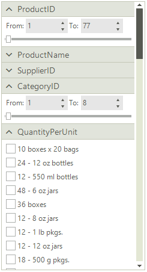
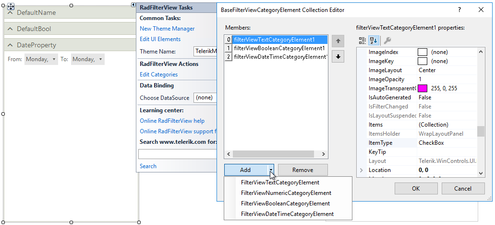

# Design Time

To start using **RadFilterView**, just drag it from the toolbox and drop it onto the form.
 
## Smart Tag 

Select **RadFilterView** and click the small arrow on the top right position in order to open the Smart Tag. It allows you to set the **DataSource** property:

Thus, when you run the project, the appropriate filter view group elements will be generated considering the available fields and fields type in the applied source collection:

## Edit Categories

The "Edit categories" option allows you to define your own category elements:

 
# See Also

* [Getting Started]()
* [Structure]()
 
        
