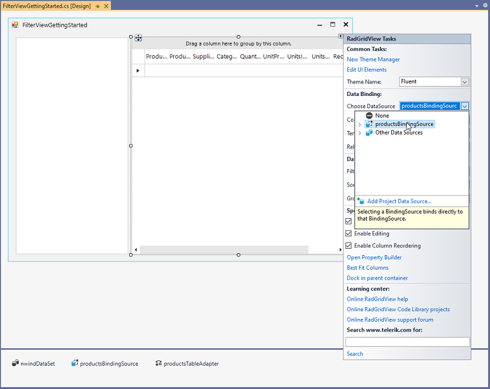
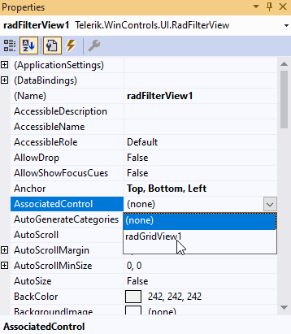

# Getting Started

This article shows how you can start using **RadFilterView** and using it for filtering a **RadGridView** control.

1. Drag a **RadFilterView** from the toolbox and drop it onto the form.

2. Drag a **RadGridView** from the toolbox and drop it onto the form.

3. Set the **DataSource** property of RadGridView, e.g. use the Northwind.Products table, to populate it with data. 

	

4. Enable the filtering functionality in RadGridView, set the **EnableFiltering** property to true.

	

5. Set the **AssociatedControl** of **RadFilterView** to be the grid.

	

That's it. You can now filter the grid by using the automatically generated categories in **RadFilterView**. 


Steps 3-5 can also be performed programmatically:

{{source=..\SamplesCS\FilterView\FilterViewGettingStarted.cs region=GettingStarted}} 
{{source=..\SamplesVB\FilterView\FilterViewGettingStarted.vb region=GettingStarted}} 

````C#

this.radGridView1.DataSource = this.productsBindingSource;
this.radGridView1.EnableFiltering = true;
this.radFilterView1.AssociatedControl = this.radGridView1;

````
````VB.NET
Me.RadGridView1.DataSource = Me.ProductsBindingSource
Me.RadGridView1.EnableFiltering = True
Me.RadFilterView1.AssociatedControl = Me.RadGridView1

````

{{endregion}}  

 
# See Also

* [Design Time]()
* [Structure]()
 
        
