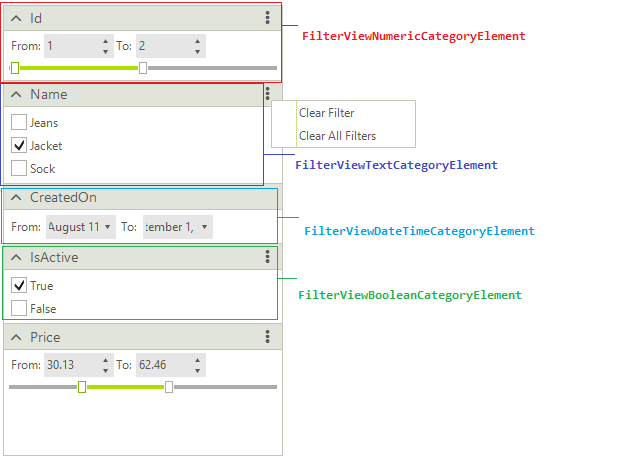
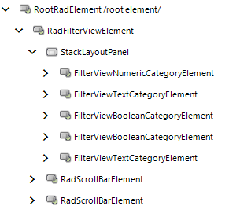

# Structure

This article describes the inner structure and organization of the elements which build **RadFilterView**.

**RadFilterView** is build of different filter view group elements. The control uses a **FilterViewCategoriesFactory** that creates the necessary category element considering the property data type:

* **FilterViewNumericCategoryElement**: used for numeric types. It generates two RadSpinEditorElements allowing you to specify a range of numeric values. A RadTrackBarElement is also created providing a different user experience for defining a numeric range. 
* **FilterViewDateTimeCategoryElement**: used for DateTime properties. It generates two RadDateTimePickerElements allowing you to specify a date range. 
* **FilterViewBooleanCategoryElement**: used for boolean fields. Two RadCheckBoxElements are created allowing you to easily filter by True/False values. 
* **FilterViewTextCategoryElement**: default category element. It generates a set of check boxes for each string value. 
 
## Elements Hierarchy

 
 
# See Also

* [Getting Started]()
* [Design Time]()
 
        
