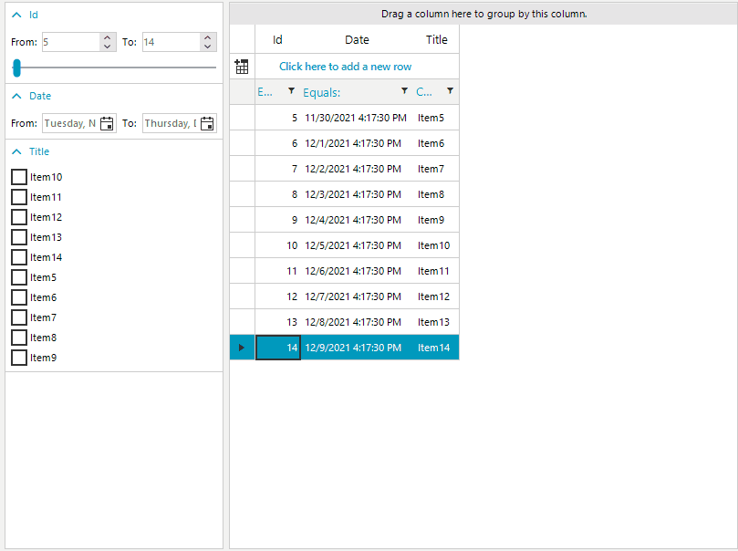

# Use FilterView in Unbound Mode

In the general case, the RadFilterView control will use the __DataSource__ property of the associated control to generate its filter categories. However, if the DataSource is null, no filter categories will be created. In this unbound mode we will need to manually create our filter view categories. This article shows how you can do that, step by step.

For the purpose of this article, we are going to use RadGridView in unbound mode. This means that the columns and the data will be created in code.
1\. First, we can go and drag the RadFilterView and the RadGridView from the toolbox and drop them onto the form. 
2\. Then we can create our columns and create some dummy data. 
3\. The next step is to set the AssociatedControl property of the RadFilterView to the RadGridView.

{{source=..\SamplesCS\FilterView\FilterViewUnboundMode.cs region=PopulateGridView}} 
{{source=..\SamplesVB\FilterView\FilterViewUnboundMode.vb region=PopulateGridView}} 

````C#
public RadForm1()
{
	InitializeComponent();

	GridViewDecimalColumn decimalColumn = new GridViewDecimalColumn("Id");
	this.radGridView1.Columns.Add(decimalColumn);

	GridViewDateTimeColumn dateColumn = new GridViewDateTimeColumn("Date");
	this.radGridView1.Columns.Add(dateColumn);

	GridViewTextBoxColumn textColumn = new GridViewTextBoxColumn("Title");
	this.radGridView1.Columns.Add(textColumn);

	for (int i = 5; i < 15; i++)
	{
		this.radGridView1.Rows.Add(i, DateTime.Now.AddDays(i), "Item" + i);
	}
	this.radFilterView1.AssociatedControl = this.radGridView1;
}

````
````VB.NET
Public Partial Class FilterViewUnboundMode
	Inherits Form

	Public Sub New()
		InitializeComponent()
		Dim decimalColumn As GridViewDecimalColumn = New GridViewDecimalColumn("Id")
		Me.radGridView1.Columns.Add(decimalColumn)
		Dim dateColumn As GridViewDateTimeColumn = New GridViewDateTimeColumn("Date")
		Me.radGridView1.Columns.Add(dateColumn)
		Dim textColumn As GridViewTextBoxColumn = New GridViewTextBoxColumn("Title")
		Me.radGridView1.Columns.Add(textColumn)

		For i As Integer = 5 To 15 - 1
			Me.radGridView1.Rows.Add(i, DateTime.Now.AddDays(i), "Item" & i)
		Next
		Me.radFilterView1.AssociatedControl = Me.radGridView1		
	End Sub
End Class

````

{{endregion}} 


If we run the example, we can see that the __RadGridView__ is populated correctly, but the __RadFilterView__ will remain empty. As the __DataSource__ of the __RadGridView__ is null, the __RadFilterView__ control won't be aware which filter categories need to be created. Upon checking the RadGridView we can create 3 filter categories for the following ID,Date and Title columns.

{{source=..\SamplesCS\FilterView\FilterViewUnboundMode.cs region=CreateFilterViewCategories}} 
{{source=..\SamplesVB\FilterView\FilterViewUnboundMode.vb region=CreateFilterViewCategories}} 

````C#
ICollection<object> numericValues = new List<object>();
ICollection<object> dateTimeValues = new List<object>();
ICollection<object> textValues = new List<object>();

FilterViewNumericCategoryElement numericFilterCategory = new FilterViewNumericCategoryElement();
numericFilterCategory.PropertyName = "Id";
foreach (var item in decimalColumn.DistinctValues)
{
	numericValues.Add(item);
}
numericFilterCategory.CreateItems(numericValues);
this.radFilterView1.Categories.Add(numericFilterCategory);            

FilterViewDateTimeCategoryElement dateTimeFilterCategory = new FilterViewDateTimeCategoryElement();
dateTimeFilterCategory.PropertyName = "Date";
foreach (var item in dateColumn.DistinctValues)
{
	dateTimeValues.Add(item);
}
dateTimeFilterCategory.CreateItems(dateTimeValues);
this.radFilterView1.Categories.Add(dateTimeFilterCategory);

FilterViewTextCategoryElement stringFilterCategory = new FilterViewTextCategoryElement();
stringFilterCategory.PropertyName = "Title";
foreach (var item in textColumn.DistinctValues)
{
	textValues.Add(item);
}
stringFilterCategory.CreateItems(textValues);
this.radFilterView1.Categories.Add(stringFilterCategory);
 
````
````VB.NET
Private numericValues As ICollection(Of Object) = New List(Of Object)()
Private dateTimeValues As ICollection(Of Object) = New List(Of Object)()
Private textValues As ICollection(Of Object) = New List(Of Object)()

Dim numericFilterCategory As FilterViewNumericCategoryElement = New FilterViewNumericCategoryElement()
numericFilterCategory.PropertyName = "Id"

For Each item In decimalColumn.DistinctValues
    numericValues.Add(item)
Next

numericFilterCategory.CreateItems(numericValues)
Me.radFilterView1.Categories.Add(numericFilterCategory)
Dim dateTimeFilterCategory As FilterViewDateTimeCategoryElement = New FilterViewDateTimeCategoryElement()
dateTimeFilterCategory.PropertyName = "Date"

For Each item In dateColumn.DistinctValues
    dateTimeValues.Add(item)
Next

dateTimeFilterCategory.CreateItems(dateTimeValues)
Me.radFilterView1.Categories.Add(dateTimeFilterCategory)
Dim stringFilterCategory As FilterViewTextCategoryElement = New FilterViewTextCategoryElement()
stringFilterCategory.PropertyName = "Title"

For Each item In textColumn.DistinctValues
    textValues.Add(item)
Next

stringFilterCategory.CreateItems(textValues)
Me.radFilterView1.Categories.Add(stringFilterCategory)

````

{{endregion}} 

4\. In the above code snippet we are creating FilterViewNumericCategoryElement, FilterViewDateTimeCategoryElement and FilterViewTextCategoryElement filter categories. You can observe that the CreateItems() method of these categories need to be called. The DistinctValues collection property can be pass as a parameter. That collection will be use to create the filter values for each filter category.

> Any changes to RadGridView cells in unbound mode won't be reflected in the RadFilterView control. If a cell value is edited, you will need to call the CreateItems() method for the respected filter category.



Here is the complete code snippet.

{{source=..\SamplesCS\FilterView\FilterViewUnboundMode.cs region=CompleteCodeSnippetExample}} 
{{source=..\SamplesVB\FilterView\FilterViewUnboundMode.vb region=CompleteCodeSnippetExample}} 

````C#
public partial class RadForm1 : Telerik.WinControls.UI.RadForm
{
	ICollection<object> numericValues = new List<object>();
	ICollection<object> dateTimeValues = new List<object>();
	ICollection<object> textValues = new List<object>();

	public RadForm1()
	{
		InitializeComponent();

		GridViewDecimalColumn decimalColumn = new GridViewDecimalColumn("Id");
		this.radGridView1.Columns.Add(decimalColumn);

		GridViewDateTimeColumn dateColumn = new GridViewDateTimeColumn("Date");
		this.radGridView1.Columns.Add(dateColumn);

		GridViewTextBoxColumn textColumn = new GridViewTextBoxColumn("Title");
		this.radGridView1.Columns.Add(textColumn);

		for (int i = 5; i < 15; i++)
		{
			this.radGridView1.Rows.Add(i, DateTime.Now.AddDays(i), "Item" + i);
		}

		FilterViewNumericCategoryElement numericFilterCategory = new FilterViewNumericCategoryElement();
		numericFilterCategory.PropertyName = "Id";
		foreach (var item in decimalColumn.DistinctValues)
		{
			numericValues.Add(item);
		}
		numericFilterCategory.CreateItems(numericValues);
		this.radFilterView1.Categories.Add(numericFilterCategory);            

		FilterViewDateTimeCategoryElement dateTimeFilterCategory = new FilterViewDateTimeCategoryElement();
		dateTimeFilterCategory.PropertyName = "Date";
		foreach (var item in dateColumn.DistinctValues)
		{
			dateTimeValues.Add(item);
		}
		dateTimeFilterCategory.CreateItems(dateTimeValues);
		this.radFilterView1.Categories.Add(dateTimeFilterCategory);

		FilterViewTextCategoryElement stringFilterCategory = new FilterViewTextCategoryElement();
		stringFilterCategory.PropertyName = "Title";
		foreach (var item in textColumn.DistinctValues)
		{
			textValues.Add(item);
		}
		stringFilterCategory.CreateItems(textValues);
		this.radFilterView1.Categories.Add(stringFilterCategory);

		this.radFilterView1.AssociatedControl = this.radGridView1;
	}
}
 
````
````VB.NET
Partial Public Class FilterViewUnboundMode
    Inherits Form

    Private numericValues As ICollection(Of Object) = New List(Of Object)()
    Private dateTimeValues As ICollection(Of Object) = New List(Of Object)()
    Private textValues As ICollection(Of Object) = New List(Of Object)()

    Public Sub New()
        Dim decimalColumn As GridViewDecimalColumn = New GridViewDecimalColumn("Id")
        Me.radGridView1.Columns.Add(decimalColumn)
        Dim dateColumn As GridViewDateTimeColumn = New GridViewDateTimeColumn("Date")
        Me.radGridView1.Columns.Add(dateColumn)
        Dim textColumn As GridViewTextBoxColumn = New GridViewTextBoxColumn("Title")
        Me.radGridView1.Columns.Add(textColumn)

        For i As Integer = 5 To 15 - 1
            Me.radGridView1.Rows.Add(i, DateTime.Now.AddDays(i), "Item" & i)
        Next

        Dim numericFilterCategory As FilterViewNumericCategoryElement = New FilterViewNumericCategoryElement()
        numericFilterCategory.PropertyName = "Id"

        For Each item In decimalColumn.DistinctValues
            numericValues.Add(item)
        Next

        numericFilterCategory.CreateItems(numericValues)
        Me.radFilterView1.Categories.Add(numericFilterCategory)
        Dim dateTimeFilterCategory As FilterViewDateTimeCategoryElement = New FilterViewDateTimeCategoryElement()
        dateTimeFilterCategory.PropertyName = "Date"

        For Each item In dateColumn.DistinctValues
            dateTimeValues.Add(item)
        Next

        dateTimeFilterCategory.CreateItems(dateTimeValues)
        Me.radFilterView1.Categories.Add(dateTimeFilterCategory)
        Dim stringFilterCategory As FilterViewTextCategoryElement = New FilterViewTextCategoryElement()
        stringFilterCategory.PropertyName = "Title"

        For Each item In textColumn.DistinctValues
            textValues.Add(item)
        Next

        stringFilterCategory.CreateItems(textValues)
        Me.radFilterView1.Categories.Add(stringFilterCategory)
        Me.radFilterView1.AssociatedControl = Me.radGridView1
    End Sub
End Class

````
 
# See Also

* [Design Time]()
* [Structure]()
 
        
