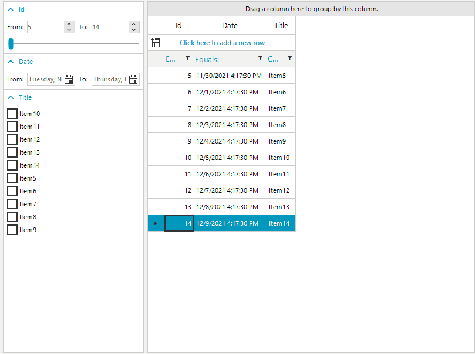

# Use FilterView in Unbound Mode

In the general case, the RadFilterView control will use the __DataSource__ property of the associated control to generate its filter categories. However, if the DataSource is null, no filter categories will be created. In this unbound mode we will need to manually create our filter view categories. This article shows how you can do that, step by step.

For the purpose of this article, we are going to use RadGridView in unbound mode. This means that the columns and the data will be created in code.
1\. First, we can go and drag the RadFilterView and the RadGridView from the toolbox and drop them onto the form. 
2\. Then we can create our columns and create some dummy data. 
3\. The next step is to set the AssociatedControl property of the RadFilterView to the RadGridView.

<snippet id='filter-view-unbound-mode-populategridview-cs' />
<snippet id='filter-view-unbound-mode-populategridview-vb' />

If we run the example, we can see that the __RadGridView__ is populated correctly, but the __RadFilterView__ will remain empty. As the __DataSource__ of the __RadGridView__ is null, the __RadFilterView__ control won't be aware which filter categories need to be created. Upon checking the RadGridView we can create 3 filter categories for the following ID,Date and Title columns.

<snippet id='filter-view-unbound-mode-createfilterviewcategories-cs' />
<snippet id='filter-view-unbound-mode-createfilterviewcategories-vb' />

4\. In the above code snippet we are creating FilterViewNumericCategoryElement, FilterViewDateTimeCategoryElement and FilterViewTextCategoryElement filter categories. You can observe that the CreateItems() method of these categories need to be called. The DistinctValues collection property can be pass as a parameter. That collection will be use to create the filter values for each filter category.

> Any changes to RadGridView cells in unbound mode won't be reflected in the RadFilterView control. If a cell value is edited, you will need to call the CreateItems() method for the respected filter category.

Here is the complete code snippet.

<snippet id='filter-view-unbound-mode-completecodesnippetexample-cs' />
<snippet id='filter-view-unbound-mode-completecodesnippetexample-vb' />

 
# See Also

* [Design Time]()
* [Structure]()
 
        
