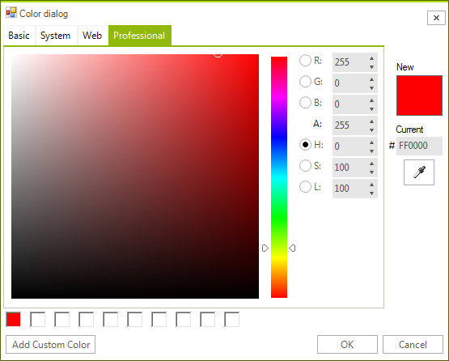

# ColorDialog

__RadColorDialog__ is a lightweight UI component that allows users to select from RGB or HEX color models. The color palettes are skinnable and highly configurable. It offers a great amount of flexibility in selecting colors from web, system, and basic colors together with the ability to fine-tune and pick colors directly from the screen.

You can localize the labeling of each of the major portions of the control. Each of the control elements can be hidden or shown.





# See Also

* [Structure]()	
* [Usability]()	