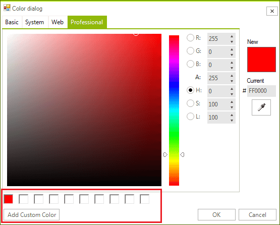

# Custom Colors

**RadColorDialog** displays a row of slots where selected custom colors can be saved:

>caption Figure 1: Custom Colors

The RadColorSelector.**CustomColorsConfigLocationNeeded** event fires when custom colors configuration is about to be saved and loaded at a later moment. In the **CustomColorsEventArgs** you have the option to change the location  of the **custom_colors.cfg**. When creating the CustomColors, **RadColorDialog** checks whether a **custom_colors.cfg** file exists to load the colors. The default location is **C:\Users\'User Name'\AppData\Local**. You can create a default file with a predefined set of colors at the specified location. Thus, the desired colors will be loaded. 

The following code snippet demonstrates how to change the default location of the file and file name that stores the custom colors:

<snippet id='colordialog-colordialog1-customcolors-cs' />
<snippet id='colordialog-colordialog1-customcolors-vb' />

 

