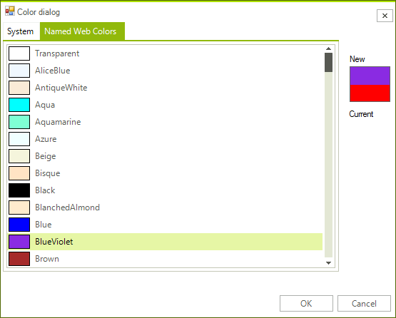

# Getting Started

The following tutorial demonstrates configuring the __RadColorDialog__, localizing tab labeling and responding to the __OK__ button click.

>caption Figure 1: Getting Started with RadColorDialog



1\. Drop a __RadColorDialog__ on the form.

2\. Set the ColorDialogForm.__ShowBasicColors__ property to *false*.

3\. Set the ColorDialogForm.__ShowProfessionalColors__ property to *false*.

4\. Set the ColorDialogForm.__ShowHEXColorsValue__ property to *false*. 

5\. Set the ColorDialogForm.__AllowPickColorFromScreen__ property to *false*.

6\. Set the ColorDialogForm.__ShowCustomColors__ property to *false*.

7\. Change the ColorDialogForm.__WebTabHeading__ property to read *Named Web Colors*.

8\. Get the __SelectedColor__ or __SelectedHlsColor__, check the returned __DialogResult__:

#### Check the selected values in RadColorDialog 

{{source=..\SamplesCS\Forms and Dialogs\ColorDialog1.cs region=getTheSelectedColors}} 
{{source=..\SamplesVB\Forms and Dialogs\ColorDialog1.vb region=getTheSelectedColors}} 

````C#
if (radColorDialog1.ShowDialog() == DialogResult.OK)
{
    Color color = radColorDialog1.SelectedColor;
    HslColor hslColor = radColorDialog1.SelectedHslColor;
}

````
````VB.NET
If RadColorDialog1.ShowDialog() = DialogResult.OK Then
    Dim color As Color = RadColorDialog1.SelectedColor
    Dim hslColor As Telerik.WinControls.HslColor = RadColorDialog1.SelectedHslColor
End If

````

{{endregion}} 

9\. Press __F5__ to run the application.

# See Also

* [Usability]()
