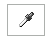
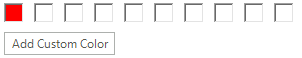
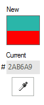
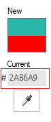

# Properties

|Property|Description|Image|
|----|----|----|
|__ColorDialogForm__|Gets the instance of RadColorDialogForm, which incorporates various settings of the underlaying color selection Form and ColorSelector user control.||
|__Icon__|Gets or sets the icon displayed for this dialog.||
|RadColorDialogForm.__ActiveMode__|Determines the currently selected tab.  Valid enumeration values from __Telerik.WinControls.ColorPickerActiveMode__ are *Basic*, *System*, *Web*,*Professional*.||
|RadColorDialogForm.__AllowColorPickFromScreen__|When *true* (the default) the "eye dropper" tool is displayed.||
|RadColorDialogForm.__AllowColorSaving__|Toggles the "Add a custom color" button visibility.||
|__BackColor__|The background color of the color selector as a whole. You can also set this color to be *Transparent* to have it blend in with your other UI elements.||
|__ForeColor__|The color for labels and text entry.||
|__SelectedColor__|In the figure below the __SelectedColor__ is labeled as "New".||
|RadColorDialogForm.__OldColor__|In the figure below the __OldColor__ is labeled as "Current".||
|RadColorDialogForm.__ShowBasicColors__|If true (the default) the corresponding Basic tab is displayed.||
|RadColorDialogForm.__ShowSystemColors__|If true (the default) the corresponding System tab is displayed.||
|RadColorDialogForm.__ShowWebColors__|If true (the default) the corresponding Web tab is displayed.||
|RadColorDialogForm.__ShowProfessionalColors__|If true (the default) the corresponding Professional tab is displayed.||
|RadColorDialogForm.__AllowEditHEXValue__|If true (the default) enables hexadecimal entry of color values.||
|RadColorDialogForm.__ShowHEXColorValue__|If true (the default) displays the hexadecimal entry of color values.||
|RadColorDialogForm.__CustomColors[WinForms RadColorDialog ]__|This is a read-only array of Color objects.  You can query the contents of the custom colors displayed along the bottom of the selector.||
|RadColorDialogForm.__RadColorSelector__|Gets the color selector||
|RadColorDialogForm.__AddNewColorButtonText__|Gets or sets the text of the add new color button.||
|RadColorDialogForm.__BasicTabHeading__|Gets or sets the heading of the basic colors tab.||
|RadColorDialogForm.__SystemTabHeading__|Gets or sets the heading of the system colors tab.||
|RadColorDialogForm.__WebTabHeading__|Gets or sets the heading of the web colors tab.||
|RadColorDialogForm.__ProfessionalTabHeading__|Gets or sets the heading of the professional colors tab.||
|RadColorDialogForm.__SelectedColorLabelHeading__|Gets or sets the heading of the selected color label.||
|RadColorDialogForm.__OldColorLabelHeading__|Gets or sets the heading of the old color label.||
|RadColorDialogForm.__SelectedColor__|Gets or sets the new color.||
|RadColorDialogForm.__SelectedHslColor__|Gets or sets selected HSL color.||
|RadColorSelector.__SaveCustomColors__|Gets or sets a value indicatign whether custom colors should be save upon exiting the color picker.||

You can find below how to enlist all custom colors in __RadColorDialog__:

#### Enlist the current custom colors in RadColorDialog 

{{source=..\SamplesCS\Forms and Dialogs\ColorDialog1.cs region=enlistTheCustomColors}} 
{{source=..\SamplesVB\Forms and Dialogs\ColorDialog1.vb region=enlistTheCustomColors}} 

````C#
private void radButton1_Click(object sender, EventArgs e)
{
    StringBuilder sb = new StringBuilder();
    foreach (Color color in radColorDialog1.CustomColors)
    {
        sb.Append(color.ToString());
        sb.Append(System.Environment.NewLine);
    }
    MessageBox.Show(sb.ToString());
}

````
````VB.NET
Private Sub RadButton1_Click_1(ByVal sender As System.Object, ByVal e As System.EventArgs) Handles RadButton1.Click
    Dim sb As New StringBuilder()
    For Each color As Color In RadColorDialog1.CustomColors
        sb.Append(color.ToString())
        sb.Append(System.Environment.NewLine)
    Next
    MessageBox.Show(sb.ToString())
End Sub

````

{{endregion}} 

# Methods

|Method|Description|
|----|----|
|__Reset__|Resets the properties of a color dialog box to their default values. Replaces the underlaying ColorDialogForm with new instance.|


# Events

|Event|Description|
|----|----|
|RadColorDialogForm.__ColorChanged__|Fires when the selected color has changed.|
|RadColorSelector.__OkButtonClicked__|Fires when the OK button is clicked||
|RadColorSelector.__CancelButtonClicked__|Fires when the Cancel button is clicked||
|RadColorSelector.__CustomColorsConfigLocationNeeded__|Fires when custom colors configuration is about to be saved or loaded.Can be used to change the default location of the configuration file.||


# See Also

* [Properties](https://docs.telerik.com/devtools/winforms/api/telerik.wincontrols.radcolordialog.html#properties)
* [Methods](https://docs.telerik.com/devtools/winforms/api/telerik.wincontrols.radcolordialog.html#methods)
* [RadColorDialogForm's Properties](https://docs.telerik.com/devtools/winforms/api/telerik.wincontrols.ui.radcolordialogform.html#properties)
* [RadColorDialogForm's Methods](https://docs.telerik.com/devtools/winforms/api/telerik.wincontrols.ui.radcolordialogform.html#methods)
* [RadColorDialogForm's Events](https://docs.telerik.com/devtools/winforms/api/telerik.wincontrols.ui.radcolordialogform.html#events)


