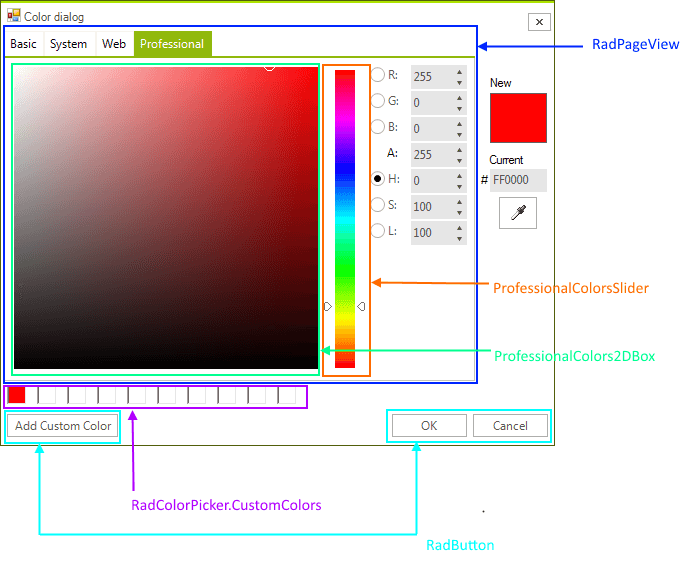

# Structure 

__RadColorDialog__ shows a __RadColorDialogForm__ which represents a dialog containing a color picker. The __RadColorDialogForm__ uses a __UserControl__ for the color selector. It is of type __RadColorSelector__.

>caption Figure 1: RadColorSelector's elements hierarchy

# See Also

* [Usability]()
