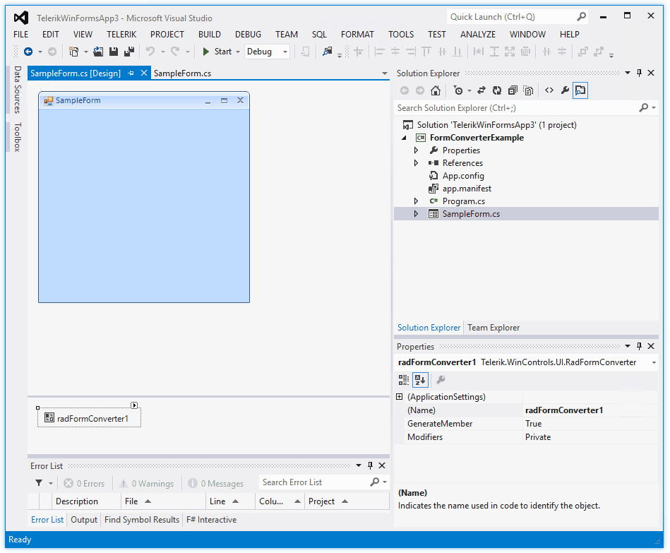
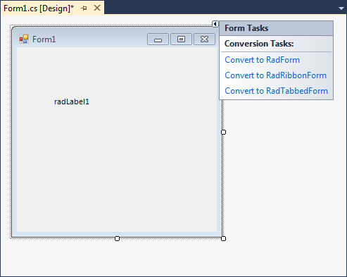

# Form Converter

**RadFormConverter** is a component which can be used in the designer of Visual Studio. It allows an easy conversion between **RadForm**, **RadRibbonForm**, and the standard **Form**.

>caption Figure 1: RadFormConverter

The actual conversion process is executed after selecting an item from the component`s action list. The available options are: 

* **Convert to Form**: Converts a **RadForm**, **RadRibbonForm** or **RadTabbedForm** to the standard System.Windows.Forms.Form class. 
* **Convert to RadForm**: Converts a standard, ribbon or tabbed form to a **RadForm**.
* **Convert to RadRibbonForm**: Converts a standard or **RadForm** or a **RadTabbedForm** to a **RadRibbonForm**.
* **Convert to RadTabbedForm**: Converts a standard or **RadForm** or a **RadRibbonForm** to a **RadTabbedForm**.

>note Any controls added in the Controls collection of the form will not be influenced by the conversion process.

If you have at least one control from the Telerik UI for WinForms suite on the standard MS Form, you can also use the Form's smart tag in order to convert it to a **RadForm**, **RadRibbonForm** or **RadTabbedForm**. 

>caption Figure 2: Form's Smart Tag

# See Also 

* [RadForm]()
* [RadRibbonForm]()
 

