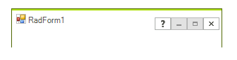

# Accessing RadForm Elements
 
The __RadForm__ is build of a __RadFormTitleBarElement__, __FormBorderPrimitive__ and a __FormImageBorderPrimitive.__ The following topic demonstrates how to access and modify these elements.

## Accessing the RadTitleBarElement

The __RadFormTitleBarElement__ is positioned on the top of the form and its default behavior is to display an icon, text, and the help, minimize, maximize/restore and close buttons. You can access the __RadFormTitleBarElement__ the following way:

#### Accessing RadForm elements 

<snippet id='form-form1-accessingradformelements-cs' />
<snippet id='form-form1-accessingradformelements-vb' />

 

>caption Figure 1: TitleBar
  

>note By default, the __HelpButton__ is not shown. Set the __HelpButton__ property to *true* to display a Help button in the form's caption bar.The value of the __HelpButton__ property is ignored if the Maximize or Minimize buttons are shown.
> An alternative solution is to set its __Visibility__ property to *ElementVisibility.Visible* in order to be displayed. The __HelpButtonClicked__ event is fired when Help button in the title bar is clicked. It can be canceled. However, if it is not canceled, the __HelpRequested__ event will be fired when the Help cursor is clicked on any Control. 

## Adding a new button to the title bar

You can easily extend the __RadFormTitleBarElement__ 's functionality by adding new elements to its hierarchy. The following code snippet demonstrated how to add a __RadButtonElement__ before the minimize button in the __RadFormTitleBarElement__:

#### Adding new button to the title bar 

<snippet id='form-form1-addingnewbuttontothetitlebar-cs' />
<snippet id='form-form1-addingnewbuttontothetitlebar-vb' />

 
 

## Accessing the Form Borders

The border of a __RadForm__ control is composed of two border primitives which, together, define the visual appearance of the whole border: __FormBorderPrimitive__ and __FormImageBorderPrimitive__.

## Accessing the FormBorderPrimitive

The __FormBorderPrimitive__ represents the outer thin border that surrounds a __RadForm__ control. The following code snippet demonstrates how to modify the color of this primitive:

#### Accessing the FormBorderPrimitive 

<snippet id='form-form1-accessingtheformborderprimitive-cs' />
<snippet id='form-form1-accessingtheformborderprimitive-vb' />

 

>note The visual appearance of the border and also for the whole RadForm control can be designed in the Visual Style Builder.
>

## Accessing the FormImageBorderPrimitive

The __FormImageBorderPrimitive__ represents the inner thick border that starts from the bottom-left corner of the title bar, surrounds the __RadForm__ control and ends at the bottom-right corner of the title bar. The __FormImageBorderPrimitive__ provides you with the possibility to define borders for your form which are built of images and thus achieve better look-and-feel for your form. Without images set, the __FormImageBorderPrimitive__ paints as a one-color-border with the color set to the __BackColor__ property of the primitive. 

The following code snippet demonstrates how to set the __BackColor__ of the __FormImageBorderPrimitive__ which is painted when no images are defined:

#### Accessing the FormImageBorderPrimitive 

<snippet id='form-form1-accessingtheformimageborderprimitive-cs' />
<snippet id='form-form1-accessingtheformimageborderprimitive-vb' />

 

 
>note More information on how to use the __FormImageBorderPrimitive__ can be found in the separate topic: [Using the FormImageBorderPrimitive]().
>

