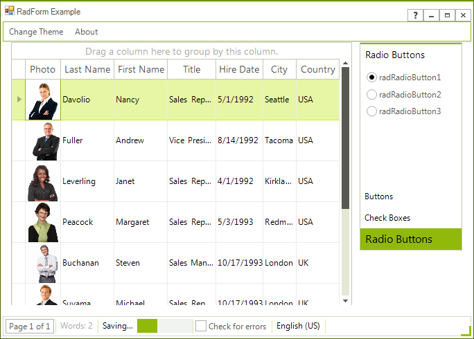

# WinForms Form Overview

The __RadForm__ control is an extended standard Windows Form that fully supports the [Telerik Presentation Framework (TPF)]() and the Telerik's theming mechanism. The control is built of a [RadTitleBar]() component and a border that can be easily designed in the Visual Style Builder. __RadForm__ also supports MDI (Multiple Document Interface) and Right-to-Left languages. Other features of __RadForm__ are the active/inactive visual states support, runtime switching between customized or plain Windows Form and also the possibility for adding __RadElement__ instances in the Title Bar Element.

>note RadForm supports just one shape. If you need more advance shapes please refer to [ShapedForm]().
>




 
>caption RadForm

# See Also 

* [Structure]()
* [Getting Started]()
 

