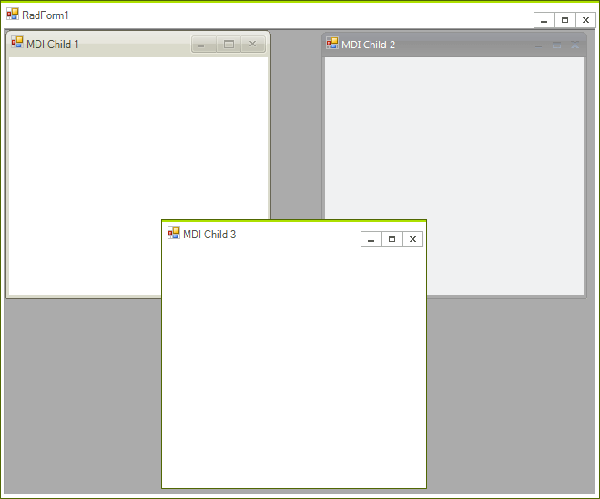
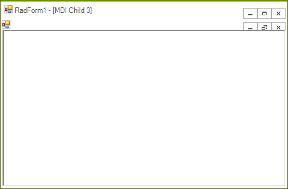

# MDI
 
__RadForm__ can be used in Multiple Document Interface (MDI) scenarios. With MDI, a single menu bar is shared between all child windows, reducing clutter and increasing the efficient use of screen space. __RadForm__ fits well in MDI cases by automatically providing minimize, restore, maximize, and inactive states.

>caption Figure 1: MDI



## Adding MDI Child Forms to RadForm

The following code snippet adds three __RadForm__ instances to a MDI container and applies different theme to each child:

#### Adding RadForm MDI children to RadForm 

{{source=..\SamplesCS\Forms and Dialogs\Form1.cs region=addingMDIChildFormsToAForm}} 
{{source=..\SamplesVB\Forms and Dialogs\Form1.vb region=addingMDIChildFormsToAForm}} 

````C#
this.IsMdiContainer = true;
 
RadForm form = new RadForm();
form.Text = "MDI Child 1";
form.MdiParent = this;
form.ThemeName = "Desert";
form.Show();
 
form = new RadForm();
form.Text = "MDI Child 2";
form.MdiParent = this;
form.ThemeName = "Office2007Black";
form.Show();
 
form = new RadForm();
form.Text = "MDI Child 3";
form.MdiParent = this;
form.ThemeName = "TelerikMetro";
form.Show();

````
````VB.NET
Me.IsMdiContainer = True
Dim form As New RadForm()
form.Text = "MDI Child 1"
form.MdiParent = Me
form.ThemeName = "Desert"
form.Show()
form = New RadForm()
form.Text = "MDI Child 2"
form.MdiParent = Me
form.ThemeName = "Office2007Black"
form.Show()
form = New RadForm()
form.Text = "MDI Child 3"
form.MdiParent = Me
form.ThemeName = "TelerikMetro"
form.Show()

````

{{endregion}} 
 

## Default MDI Menu Strip

When a MDI child Form is maximized, it automatically hides its title bar and the parent form displays a default MDI menu. This menu contains controls can execute the basic window commands on the currently maximized MDI child:

>caption Figure 2: MDI Menu Strip



The appearance of the default MDI menu can be designed in the Visual Style Builder.

## Menu Merging

Each MDI child that contains __RadMenu__ can have its menu merged with the __RadMenu__ control of the MDI parent form, if any. You can read more on this topic in the [Menu Merge section]().
