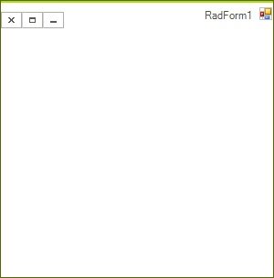

# Right-To-Left Support

__RadForm__ carries forward standard Windows Form class functionality, including full support for right-to-left cultures. By default, your __RadForm__ layout will be left-to-right. In the screenshot below, however, the __RightToLeft__ property of the __RadForm__ control is set to *Yes* and the form's title bar are drawn from right to left:

>caption Figure 1: Right-To-Left

