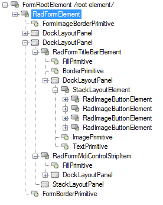

# Structure

This article describes the inner structure and organization of the elements which build the __RadForm__ control.
        
>caption Figure 1: RadForm's elements hierarchy

>caption Figure 2: RadForm's structure

 1. __RadFormElement__  
  1.1 __RadFormTitleBarElement__: represents the title bar.   
&nbsp;&nbsp;&nbsp;&nbsp;&nbsp;1.1.1 __RadImageButtonElement__: represents each system button.  
  1.2 __RadFormMdiControlStripItem__: represents the MdiControlStrip item that should appear below the title bar when a MDI child is maximized.  
  1.3 __FormBorderPrimitive__: represents the form's border

# See Also

* [Getting Started]()

