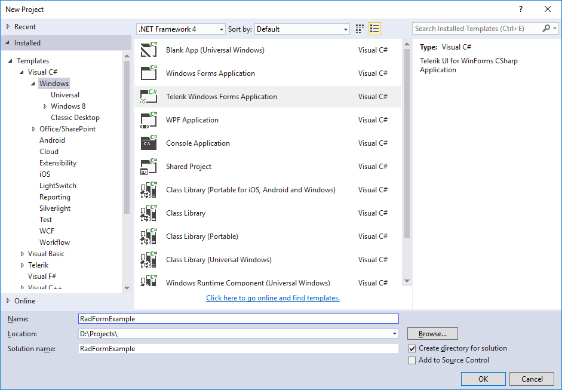
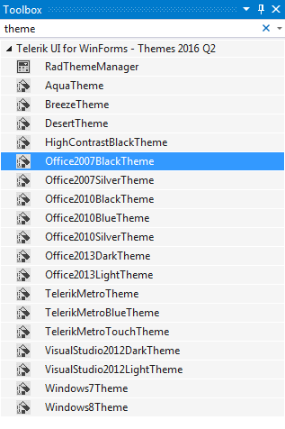
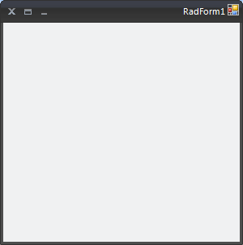

# Themes
 
__RadForm__ comes with a number of themes which can be easily applied by setting the __ThemeName__ property. This topic demonstrates how to apply predefined themes.      

## Applying Themes to RadForm

The themes allow you to modify the look-and-feel of a __RadForm__ instance by simply setting the __ThemeName__ property.        

This section shows how to apply the __Office2007Black__ theme to a __RadForm__ in the Visual Studio designer:
        
1\. Add a __RadForm__ item in your project or change the base class of an existing standard Windows Form to __Telerik.WinControls.UI.RadForm.__



#### Changing WinForms form to Telerik RadForm 

{{source=..\SamplesCS\Forms and Dialogs\Form1.Designer.cs region=radForm}} 
{{source=..\SamplesVB\Forms and Dialogs\Form1.Designer.vb region=radForm}} 

````C#
partial class Form1 : Telerik.WinControls.UI.RadForm

````
````VB.NET
Partial Class Form1
    Inherits Telerik.WinControls.UI.RadForm

````

{{endregion}} 
 

2\. Open the __Design View__ of the Form and open the Visual Studio Toolbox.
            
3\. In the Visual Studio Toolbox find the __Office2007BlackTheme__ component.
            


4\. Drag and drop the component onto your __RadForm.__

5\. Open the Properties Window for the form and find the __ThemeName__ property.            

6\. In order to apply the Office2007Black theme to RadForm, choose the *'Office2007Black'* option from the ThemeName drop-down:
            


>tip You do not need to add multiple Theme Components on each form which you would like to customize. By adding one Theme Component on a form, the theme is loaded in the memory and it becomes available for all __RadControls__ and __RadForms__ in your project.


# See Also 

* [Getting Started with VisualStyleBuilder]()
* [Working With Repository Items]()

