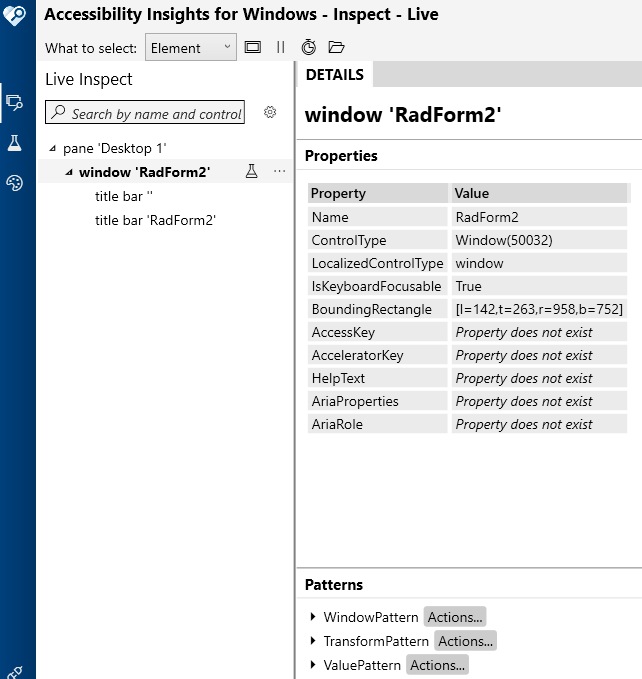

# UI Automation Support

With the __Q1 2026 Minor__ version of our controls, RadForm supports UI Automation. The current implementation of UI Automation for RadForm is similar to the MS WinForms Window Control implementation with some extended functionality. The main goal of this implementation is to ensure compliance with accessibility standards and to provide a common practice for automated testing. 

| **UIA Tree Structure**|
|------------------------|
| ├─ [RadForm](https://learn.microsoft.com/en-us/dotnet/framework/ui-automation/ui-automation-support-for-the-window-control-type) |
| &nbsp;&nbsp;└── [TitleBarElement](https://learn.microsoft.com/en-us/dotnet/framework/ui-automation/ui-automation-support-for-the-titlebar-control-type) |
| &nbsp;&nbsp;&nbsp;&nbsp; ├── ImagePrimitive (icon if non-empty) |
| &nbsp;&nbsp;&nbsp;&nbsp; ├── TextPrimitive (caption text if non-empty) |
| &nbsp;&nbsp;&nbsp;&nbsp; ├── ButtonItem (help button if visible) |
| &nbsp;&nbsp;&nbsp;&nbsp; ├── ButtonItem (minimize button if visible)|
| &nbsp;&nbsp;&nbsp;&nbsp; ├── ButtonItem (maximize button if visible)|
| &nbsp;&nbsp;&nbsp;&nbsp; └── ButtonItem (close button if visible)|

This functionality is enabled by default. To disable it, you can set the __EnableUIAutomation__ property to false.

````C#

this.radForm1.EnableUIAutomation = false;

````
````VB.NET

Me.RadForm1.EnableUIAutomation = False

````



## Relevant Properties 

The table below outlines the __UI Automation__ properties most important for understanding and interacting with RadForm control.

#### RadForm 

* AutomationElementIdentifiers.BoundingRectangleProperty.Id => this.BoundingRectangle
* AutomationElementIdentifiers.ControlTypeProperty.Id => ControlType.Window.Id
* AutomationElementIdentifiers.LocalizedControlTypeProperty.Id => "window"
* AutomationElementIdentifiers.HelpTextProperty.Id => this.Owner.AccessibleDescription
* AutomationElementIdentifiers.IsContentElementProperty.Id => true
* AutomationElementIdentifiers.IsControlElementProperty.Id => true
* AutomationElementIdentifiers.IsKeyboardFocusableProperty.Id => true
* AutomationElementIdentifiers.NameProperty.Id => `Owner.AccessibleName` if set, otherwise `Owner.Text`
* AutomationElementIdentifiers.IsOffscreenProperty.Id
* AutomationElementIdentifiers.ClickablePointProperty.Id => Horizontal center of the form, vertical center of the caption bar 
* AutomationElementIdentifiers.IsTransformPatternAvailableProperty.Id => true
* AutomationElementIdentifiers.IsDockPatternAvailableProperty.Id => true (always — pattern resolves to `null` unless `IsMdiChild`)

## Supported Control Patterns

The following section outlines the supported automation patterns for the __RadForm__ control and its constituent elements.

* [TransformPattern](https://learn.microsoft.com/en-us/dotnet/api/system.windows.automation.provider.itransformprovider?view=windowsdesktop-9.0)
* [DockPattern](https://learn.microsoft.com/en-us/dotnet/api/system.windows.automation.provider.idockprovider?view=windowsdesktop-9.0)
* [WindowPattern](https://learn.microsoft.com/en-us/dotnet/api/system.windows.automation.provider.iwindowprovider?view=windowsdesktop-9.0)


## Involved Classes

| Class | Namespace | Role |
|---|---|---|
| `RadFormUIAutomationProvider` | `UIAutomation.Window` | Root UIA provider for `RadForm` — exposes window properties, patterns, navigation, and events |
| `TitleBarElementUIAutomationProvider` | `UIAutomation.TitleBar` | Fragment provider exposed as the only UIA child of the form, representing `RadFormElement.TitleBar` |
| `RadFormTransformProvider` | `UIAutomation.Window.Patterns` | Implements `ITransformProvider` (TransformPattern) — exposes move and resize operations |
| `RadFormDockProvider` | `UIAutomation.Window.Patterns` | Implements `IDockProvider` (DockPattern) — exposes dock position for MDI child forms |
| `TitleBarWindowProvider` | `UIAutomation.TitleBar.Patterns` | Implements `IWindowProvider` (WindowPattern) — delegated through `TitleBarElementUIAutomationProvider` |

## Navigation

`RadForm` exposes exactly one UIA child: [TitleBarElementUIAutomationProvider]().

* `Navigate(FirstChild)` → returns `TitleBarElementUIAutomationProvider`
* `Navigate(LastChild)` → returns `TitleBarElementUIAutomationProvider`
* All other directions → handled by the base class