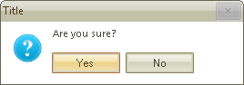

# Getting Started

The following tutorial will show you a simple usage of __RadMessageBox__:

1\. Create a new Windows Application in Visual Studio

2\. Drag and drop a __RadButton__ on the form.

3\. Subscribe to the __Click__ event of this __RadButton__.

4\. Make sure that you import/use the following namespaces 

{{source=..\SamplesCS\Forms and Dialogs\MessageBox1.cs region=namespace}} 
{{source=..\SamplesVB\Forms and Dialogs\MessageBox1.vb region=namespace}} 

````C#
using Telerik.WinControls;

````
````VB.NET
Imports Telerik.WinControls

````

{{endregion}} 
 

5\. In the RadButton.__Click__ event handler, first set the theme of the __RadMessageBox__ and then call its static __Show__ method of the __RadMessageBox__ class, passing the appropriate parameters. Set the RadMessageBox.__Show__ method to a __DialogResult__ variable: 

#### Setting a theme and showing RadMessageBox 

{{source=..\SamplesCS\Forms and Dialogs\MessageBox1.cs region=workingWithRadMessageBox}} 
{{source=..\SamplesVB\Forms and Dialogs\MessageBox1.vb region=workingWithRadMessageBox}} 

````C#
private void radButton1_Click(object sender, EventArgs e)
{
    RadMessageBox.SetThemeName("Desert");
    
    DialogResult ds = RadMessageBox.Show(this, "Are you sure?", "Title", MessageBoxButtons.YesNo, RadMessageIcon.Question);
    this.Text = ds.ToString();
}

````
````VB.NET
Private Sub RadButton1_Click(ByVal sender As System.Object, ByVal e As System.EventArgs) Handles RadButton1.Click
    RadMessageBox.SetThemeName("Desert")
    Dim ds As DialogResult = RadMessageBox.Show(Me, "Are you sure?", "Title", MessageBoxButtons.YesNo, RadMessageIcon.Question)
    Me.Text = ds.ToString()
End Sub

````

{{endregion}} 

6\. The result RadMessageBox is shown below:
    


# See Also

* [Parameters]()


