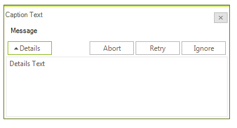

# Parameters
 
## SetThemeName method

You can easily set the __ThemeName__ of the __RadMessageBox__ by calling the __SetThemeName__ parameter, passing the theme name string:

#### Setting a theme in RadMessageBox 

{{source=..\SamplesCS\Forms and Dialogs\MessageBox1.cs region=SetThemeName}} 
{{source=..\SamplesVB\Forms and Dialogs\MessageBox1.vb region=SetThemeName}} 

````C#
RadMessageBox.SetThemeName("Desert");

````
````VB.NET
RadMessageBox.SetThemeName("Desert")

````

{{endregion}} 

## Show method

The __Show__ method displays a __RadMessageBox__. It returns a __DialogResult__ value and has a couple of overloads to suit to your needs. For a list of all methods see the API Reference section. __Show__ method could accept the following parameters:

* __Parent__ - An implementation of System.Windows.Forms.IWin32Window that will own the __RadMessageBox__.
            

* __Text__ - The text to display in the __RadMessageBox__.
            

* __Caption__ - The text to display in the title bar of the __RadMessageBox__.
            

* __Buttons__ - One of the __MessageBoxButtons__ enumeration values that specifies which buttons to display in the message box:
            

	* AbortRetryIgnore

	* OK

	* OKCancel

	* RetryCancel

	* YesNo

	* YesNoCancel

* __Icon__ - One of the __RadMessageIcon__ enumeration values that specifies which icon to display in the message box or a custom Bitmap icon that will be displayed:            

	* RadMessageIcon.*None*

	* RadMessageIcon.*Info*

	* RadMessageIcon.*Question*

	* RadMessageIcon.*Exclamation*

	* RadMessageIcon.*Error*

* __defaultBtn__ - One of the __MessageBoxDefaultButton__ enumeration values the specifies the default button for the message box:            

	* MessageBoxDefaultButton.*Button1*

	* MessageBoxDefaultButton.*Button2*

	* MessageBoxDefaultButton.*Button2*

* __Rtl__ - __RightToLeft__ settings:           

	* RightToLeft.*No*

	* RightToLeft.*Yes*

	* RightToLeft.*Inherit*

## Details Section

As of Q2 2014 __RadMessageBox__ supports details section. This section can be shown by just specifying the details text in the __Show__ method parameters:
  
{{source=..\SamplesCS\Forms and Dialogs\MessageBox1.cs region=details}} 
{{source=..\SamplesVB\Forms and Dialogs\MessageBox1.vb region=details}} 

````C#
RadMessageBox.Show("Message", "Caption Text", MessageBoxButtons.AbortRetryIgnore, "Details Text");

````
````VB.NET
RadMessageBox.Show("Message", "Caption Text", MessageBoxButtons.AbortRetryIgnore, "Details Text")
'#End Region
End Sub
s
 "LocalizationProvider"
lass MyRadMessageLocalizationProvider
Inherits RadMessageLocalizationProvider
Public Overloads Overrides Function GetLocalizedString(ByVal id As String) As String
Select Case id
    Case RadMessageStringID.AbortButton
        Return "Abbruch"
    Case RadMessageStringID.CancelButton
        Return "Löschen"
    Case RadMessageStringID.IgnoreButton
        Return "Ignorieren"
    Case RadMessageStringID.NoButton
        Return "Nein"
    Case RadMessageStringID.OKButton
        Return "OK"
    Case RadMessageStringID.RetryButton
        Return "Wiederholung"
    Case RadMessageStringID.YesButton
        Return "Ja"
    Case Else
        Return MyBase.GetLocalizedString(id)
End Select
End Function
s

````

{{endregion}} 
 

The result looks like this:
        

