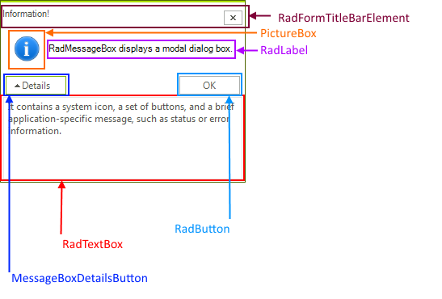

# Structure

This article describes the inner structure and organization of the elements which build the __RadMessageBox__ control. All controls are hold by the __RadMessageBoxForm__.
        
>caption Figure 1: RadMessageBoxForm's structure

# See Also

* [Getting Started]() 

